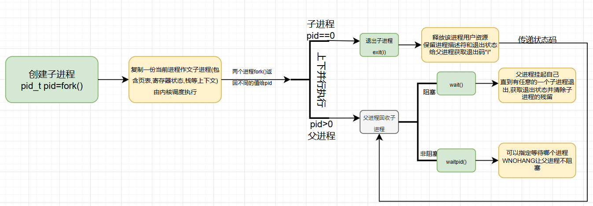
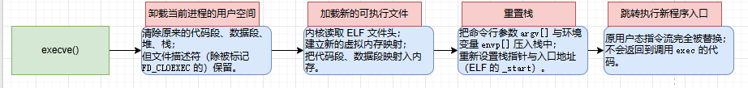

#  一.编译原理

> 这里主要以嵌入式开发为视角,了解上层操作系统在编译方面的工作

---

### 1.1GCC(GNU Compiler Collection)

> 在嵌入式开发中,GCC(GNU Compiler Collection) 不仅是个'编译器',更是一个多阶段工具链驱动器(toolchain driver)
>
> 它统筹整个"从C源码到目标机器码"的流程

1. **本质作用**

   GCC的职责是:***把人类可读的C代码,翻译成目标架构(如ARM,RISC-V,x86)的机器指令。***

2. **底层处理流程**
​编译过程实际分成四个阶段,每个阶段由独立的程序完成,GCC来调度他们:

| 阶段      | 工具  | 功能                                             | 输出                 |
| --------- | ----- | ------------------------------------------------ | -------------------- |
| 1. 预处理 | `cpp` | 宏展开、头文件合并、条件编译                     | 纯C源文件            |
| 2. 编译   | `cc1` | 词法/语法分析 → 生成中间表示（IR） → 优化 → 汇编 | 汇编文件 `.s`        |
| 3. 汇编   | `as`  | 把汇编转为机器指令（二进制）                     | 目标文件 `.o`        |
| 4. 链接   | `ld`  | 解析符号表、重定位、合并段                       | 可执行文件或固件映像 |

​	GCC 的编译核心其实依托 **中间表示（IR）** 和 **目标描述文件**：

​	-  它先将代码转换为**语言无关的中间形式（GIMPLE、RTL）**；

​	-  然后根据目标处理器描述（寄存器数目、指令模式）生成具体机器码；

​	-  这意味着同一个源代码，可通过不同后端生成不同平台代码。

​	这正是 GCC 能支撑 Linux 与嵌入式双领域的根本。


3. **在嵌入式场景中的特殊性**

   在嵌入式系统中, GCC通常不是生成给主机(如x86)跑的代码, 而是给目标MCU(如Cortex-M架构)生成的

   既**交叉编译(cross-compiler)**:将一套代码在不同的平台上进行编译

   嵌入式中常使用的交叉编译器为`arm-none-eabi-gcc`(gcc的衍生工具链)

   其中:

   arm→目标架构

   none→无操作系统	

   eabi→使用嵌入式应用二进制接口（Embedded ABI),适合裸机系统,遵循 ARM Embedded ABI 调用规范

​		

### 1.2GDB(GNU Debugger)

> 与GCC不同,GDB不关心源代码怎么编译, 而是专注于**已生成的机器指令如何被执行**,主要用于程序的调试

1. **本质作用**

​		GDB是一个通过调试符号表和目标接口(prtace或JTAG/SWD)来控制**程序执行**和**状态读取**的系统级工具,实现以下功能:

	- 暂停或恢复CPU
	- 读取/修改寄存器
	- 查看内存、变量、堆栈
	- 单步执行指令

2. **底层机制**

​		***在linux主机中***:

> 本质上,GDB并不直接操作CPU,而是利用内核提供的调试接口控制目标进程

- 内核允许 GDB 附着（attach）到某个进程；

- 每当目标进程执行到断点、信号或单步指令，内核中断它；

- GDB 读取其寄存器和内存内容，并根据符号表映射到源代码。

​		***在嵌入式系统调试:***

​			没有内核可用了，此时 GDB 通过 **远程调试协议（GDB Remote Serial Protocol, RSP）** 与硬件调试器通信

​			例如:

```nginx
GDB<--->OpenOCD<--->JTAG/SWD<--->MCU
```

数据链路通过串口、TCP或USB

GDB发命令(如读取寄存器), OpenOCD把命令翻译成调试接口操作,执行后返回结果

这就使得GDB可以在PC上,控制正在执行的裸机程序。

---


### 1.3GCC命令

> 以gcc为例,arm-none-eabi-gcc命令类似

​	1.**基本结构**

```bash
gcc [选项] 文件...
```

GCC 实际是“编译驱动器（driver）”，根据参数/选项自动调用预处理器、编译器、汇编器、链接器。
控制这些阶段的命令选项主要分为几类：

​	***阶段控制类***

| 命令           | 含义                                                         |
| -------------- | ------------------------------------------------------------ |
| `-E`           | 只进行预处理，输出预处理结果（展开宏）                       |
| `-S`           | 只编译到汇编，不汇编                                         |
| `-c`           | 编译并汇编为目标文件 `.o`，不链接,通常用于编译不包含主程序的子程序文件。 |
| `-o <file>`    | 指定输出文件名                                               |
| （无额外选项） | 完整编译、汇编、链接成可执行文件                             |

​	***优化调试类***

| 命令                  | 功能                                 |
| --------------------- | ------------------------------------ |
| `-O0/-O1/-O2/-O3/-Os` | 控制优化级别（性能与可调试性权衡）   |
| `-g`                  | 生成调试信息（供 GDB 使用）          |
| `-Wall`               | 打开常见警告                         |
| `-Werror`             | 将警告视为错误                       |
| `-std=c99`            | 指定 C 标准                          |
| `-D<macro>`           | 定义宏（相当于 `#define`）           |
| `-I<dir>`             | 添加头文件搜索路径                   |
| `-L<dir>`             | 添加库搜索路径                       |
| `-l<lib>`             | 链接指定库（如 `-lm` 表示 `libm.a`） |

​	***嵌入式选项***(arm-eabi-none-gcc)

| 命令                                 | 含义                                 |
| ------------------------------------ | ------------------------------------ |
| `-mcpu=cortex-m3` / `-march=armv7-m` | 指定目标 CPU 架构                    |
| `-mthumb`                            | 使用 Thumb 指令集                    |
| `-nostdlib`                          | 不链接标准库（裸机常用）             |
| `-T linker.ld`                       | 指定链接脚本                         |
| `-ffreestanding`                     | 不假定有完整标准环境（如 main 入口） |
| `-static`                            | 静态链接                             |
| `-Wl,<opt>`                          | 向链接器传递选项（`ld`）             |

​	***输出类型控制***(arm-eabi-none-gcc)

| 命令     | 作用                        |
| -------- | --------------------------- |
| `-c`     | 生成 `.o`                   |
| `-S`     | 生成 `.s`                   |
| `-E`     | 生成 `.i`                   |
| （默认） | 生成可执行 `.elf` 或 `.out` |

---


### 1.4GDB命令

> GDB 的命令以 **会话式指令解释器**为核心，可本地调试（Linux 进程）或远程调试（嵌入式目标）。

***启动与连接***

| 命令                      | 含义                                   |
| ------------------------- | -------------------------------------- |
| `gdb <file>`              | 启动并载入可执行文件                   |
| `target remote <IP:PORT>` | 远程连接到调试器（OpenOCD、J-Link 等） |
| `load`                    | 将程序下载到目标内存                   |
| `detach`                  | 断开调试目标                           |
| `quit`                    | 退出调试器                             |

***运行控制***

| 命令             | 功能                 |
| ---------------- | -------------------- |
| `run` / `r`      | 从头运行程序         |
| `continue` / `c` | 继续执行             |
| `next` / `n`     | 单步执行（跳过函数） |
| `step` / `s`     | 单步执行（进入函数） |
| `finish`         | 执行到当前函数返回处 |
| `kill`           | 终止被调试进程       |

***断点与观察点***

| 命令                        | 说明              |
| --------------------------- | ----------------- |
| `break <func>` / `b <line>` | 设置断点          |
| `delete`                    | 删除断点          |
| `disable` / `enable`        | 暂时关闭/开启断点 |
| `watch <var>`               | 监视变量变化      |
| `info break`                | 查看断点信息      |

***状态查看***

| 命令               | 功能                                |
| ------------------ | ----------------------------------- |
| `info registers`   | 查看寄存器                          |
| `x/<fmt> <addr>`   | 查看内存（e.g. `x/4xw 0x20000000`） |
| `print <expr>`     | 打印变量或表达式值                  |
| `backtrace` / `bt` | 查看调用栈                          |
| `info locals`      | 查看局部变量                        |
| `info args`        | 查看当前函数参数                    |

***符号与源文件控制***

| 命令                  | 功能                           |
| --------------------- | ------------------------------ |
| `list`                | 查看源代码                     |
| `info source`         | 当前源文件信息                 |
| `info functions`      | 列出所有函数                   |
| `set substitute-path` | 修正源码路径（远程调试时常用） |

***嵌入式控制***

| 命令                                                      | 说明                        |
| --------------------------------------------------------- | --------------------------- |
| `monitor reset halt`                                      | 通过调试器复位并停机        |
| `monitor flash write_image erase firmware.bin 0x08000000` | 烧录固件                    |
| `load`                                                    | 用 GDB 自带下载机制烧录 ELF |
| `target extended-remote`                                  | 允许复位后自动重连          |

***调试体验提升***

| 命令                  | 功能                     |
| --------------------- | ------------------------ |
| `display <var>`       | 每次停下自动显示变量     |
| `set print pretty on` | 美化结构体打印           |
| `define <macro>`      | 自定义命令               |
| `source script.gdb`   | 加载调试脚本（可自动化） |

***嵌入式实际调试流程:***

```bash
# 1. 启动调试器
arm-none-eabi-gdb firmware.elf

# 2. 连接目标板
(gdb) target remote localhost:3333

# 3. 下载程序
(gdb) load

# 4. 设置断点
(gdb) break main

# 5. 运行程序
(gdb) continue

# 6. 观察变量
(gdb) print sensor_value

# 7. 单步分析
(gdb) step

```

---

### 1.5Makefile

1. ***作用***

   > 在大型工程中(嵌入式, 驱动, 内核等),***Makefile是一个"自动化构建规则表"***

​		它告诉` make`工具:

​			哪些源文件需要编译;这些文件之间有哪些**依赖关系**;如何从源文件一步步生成最终目标(如.elf, .ko ,.bin)。

​	简单理解,在没有makefile的情况下,构建一个项目可能需要手动执行

```bash
arm-none-eabi-gcc -c main.c -o main.o 
arm-none-eabi-gcc -c uart.c -o uart.o
arm-none-eabi-gcc main.o uart.o -T stm32.ld -o firmware.elf
```

​	而Makefile让这些动作变成自动、可复用的

```bash
make
```

​	系统会自动判断哪些文件需要重新编译、哪些可以复用旧结果。

2.  **Make与依赖机制**

   `make`程序本质上在做三件事情

   - 读取Makefile
   - 根据时间戳判断依赖更新
   - 按规则调用命令(如gcc)重新构建项目

   如:

   ```bash
   main.o: main.c uart.h
   	arm-none-eabi-gcc -c main.c -o main.o
   ```

   这表示生成main.o依赖main.c和uart.h

   如果main.c或uart.h比main.o新则执行下面命令,否则跳过编译,节省时间(这里实际确保只有在对应文件有更新是才进行编译,相当于只编译有更新的文件)


3. **Makefile的四个关键概念**

| 名称                   | 说明                                  |
| ---------------------- | ------------------------------------- |
| **目标（target）**     | 要生成的文件，如 `app.elf`、`.o` 文件 |
| **依赖（dependency）** | 生成目标所需的源文件、头文件等        |
| **命令（command）**    | 执行的构建动作（如 `gcc ...`）        |
| **变量（variable）**   | 用来简化命令、路径等定义              |

​	linux内核和驱动编译完全基于Makefile

​	顶层 `Makefile` 调用子目录的 Makefile 实现**分层构建（recursive make）**。

---


### 1.6makefile语法

1. **基本语法**

   ```makefile
   target: dependencies
   <TAB>command
   ```

   target:要生成的目标文件

   dependencies:生成文件所需要的依赖文件

   command:执行的命令(Shell命令,必须以Tab开头)

   **make会根据时间戳判断**:如果任何依赖文件比目标文件新,就执行命令重新生成目标

   在命令前面加`@`可以控制命令的回显,没有@时运行`make`会显示命令`

2. **定义变量**

   Makefile是**弱类型**的语言,变量只是字符串替换

   引用变量使用`$(var_name)`形式

   定义变量有四种形式

   | 形式 | 含义                                                         |
   | ---- | ------------------------------------------------------------ |
   | `=`  | **延迟(递归)展开**（lazy evaluation）变量在使用时会“再展开一遍”它引用的其他变量 |
   | `:=` | **立即展开**（立即求值）,如果有引用的变量进行立即求值        |
   | `?=` | 如果未定义则赋值                                             |
   | `+=` | 追加内容                                                     |

3. **命令行****(Command Line)**

   命令行中可以写任意 Shell 命令，但必须以 **Tab** 开头。

   多条命令默认独立执行（每行一个子 Shell）

   若要多行命令共用上下文，用反斜杠 `\` 或 `&&`例:

   ```makefile
   build:
   	cd src && make
   ```

4. **自动变量(Automatic Variables)**

   Makefile在执行规则时自动生成一些上下文变量:

   | 变量 | 含义                   |
   | ---- | ---------------------- |
   | `$@` | 当前规则的目标名       |
   | `$<` | 第一个依赖文件名       |
   | `$^` | 所有依赖文件名（去重） |
   | `$?` | 比目标更新的依赖       |
   | `$*` | 不含扩展名的目标名     |

5. **模式匹配(Pattern Rules)**

   模式匹配用`%`表示任意字符序列

   ```make
   %.o: %.c
   	gcc -c $< -o $@
   
   ```
   表示所有的`.o`文件都可以由**对应**的`.c`文件生成。

6. **虚路径(VPATH)**

   在 Makefile 中，`VPATH` 或 `vpath` 关键字定义了一个或多个**搜索目录**，
   告诉 `make` —— 当找不到依赖文件时，到哪些路径下去查找。(既在当前目录下没有找到需要的文件时才去找虚路径)

   ```
   VPATH = src:include:drivers
   ```

   表示当 `make` 找不到依赖文件（比如 `main.c`）时，会自动在
    `src/`、`include/`、`drivers/` 目录下依次搜索。

7. **伪目标(Phony Targets)**

   某些目标不是文件,而是逻辑操作,如`clean`、`all`。

   ```makefile
   .PHONY: all clean
   
   all: $(TARGET)
   
   clean:
   	rm -f *.o $(TARGET)
   
   ```

   `all`和`clean`均为伪目标,用`.PHONY`来显式的指明

   这样,不管有没有clean这个文件,要运行“clean”这个目标，只有“make clean”这样


7. **控制结构(条件和循环)**

   Makefile也有简单的逻辑结构

   ```makefile
   ifeq ($(DEBUG),1)
   CFLAGS += -g
   else
   CFLAGS += -O2
   endif
   
   OBJS = $(patsubst %.c,%.o,$(wildcard *.c))
   
   
   ```

8. **内置函数**:

   | 函数$                            | 作用                      |
   | -------------------------------- | ------------------------- |
   | `$(wildcard *.c)`                | 列出所有 `.c` 文件        |
   | `$(patsubst %.c, %.o, $(SRC))`   | 把 `.c` 替换成 `.o`       |
   | `$(addprefix dir/, file1 file2)` | 添加前缀                  |
   | `$(notdir path/file.c)`          | 去除目录路径              |
   | `$(basename file.c)`             | 去掉扩展名                |
   | `$(shell command)`               | 执行 shell 命令并返回结果 |

9. 示例

   ```makefile
   #工具链配置
   CC = arm-none-eabi-gcc        
   OBJCOPY = arm-none-eabi-objcopy
   #设置编译选项
   CFLAGS = -mcpu=cortex-m3 -mthumb -O2 -g #指定CPU架构
   LDFLAGS = -T stm32.ld -nostdlib #指定连接脚本"stm32.ld" 不链接标准库
   #源文件与目标文件
   SRC = main.c uart.c gpio.c #源文件
   OBJ = $(SRC:.c=.o) #将SRC中的.c内容依次改为.o内容赋值给OBJ变量,这里定义的是中间目标
   TARGET = firmware.elf #目标文件(最终目标)
   
   .PHONY: all clean #伪目标
   
   all: $(TARGET)  #执行make all时执行:生成目标(all是第一个出现的目标所以是默认目标,及执行make和make all命令等价)
   
   $(TARGET): $(OBJ) #最终目标依赖于中间目标的更新
   	$(CC) $(OBJ) $(LDFLAGS) -o $@  #编译中间目标,   
   	$(OBJCOPY) -O binary $@ firmware.bin #链接生成最终文件$@表示目标名,既`firmware.elf`
   
   %.o: %.c#生成.o文件
   	$(CC) $(CFLAGS) -c $< -o $@ #编译.c文件生成对应的.o
   
   clean: #执行make clean时执行:清除构建生成的文件
   	rm -f $(OBJ) $(TARGET) firmware.bin
   
   ```

   值得注意的是,Make不是**按行来执行脚本**,它会先扫描整个文件构建出一个**关系依赖图(Dependency Grahp)**

   然后再按依赖的拓扑顺序决定执行哪个规则

   在上面的例子中,make会先解析出关系图

   ```css
   all→firmware.elf
   firmware.elf → main.o, uart.o, gpio.o  #firmwaer.elf 依赖后面的文件后面同理
   main.o → main.c
   uart.o → uart.c
   gpio.o → gpio.c

​		接下里Make会从all开始反向查找依赖链:

​		检查 `.o` 是否存在或比 `.c` 旧，若是则执行 `%.o: %.c`

​		所有 `.o` 更新完后再执行 `$(TARGET): $(OBJ)`

​		最后 `all` 完成

示例2:

```makefile
CC = gcc
SRCS = $(wildcard *.c) #所有.c文件
TARGETS = $(SRCS:.c=) #生成文件

.PHONY: all clean

all: $(TARGETS)
        ./$(TARGETS)
%: %.c
        $(CC) $< -o $@
        @echo "Running $@..."
        ./$@
clean:
        rm -f $(TARGETS)

```

这个makefile会扫描根目录下所有有更新的.c文件并编译为可以执行程序然后运行

clean删除所有可执行程序


## 二.C语言上层应用

> 通过C语言相关库内容实现对嵌入式上层应用制作的基本了解

### 2.1I/O

> 简单介绍Linux系统中对文件的IO操作

#### 文件描述符

**概述**

Linux系统中,内核每个进程维护一个文件描述符表，该表记录了文件描述符对应的具体文件信息，包括文件偏移量、文件的访问模式（读、写、追加等）以及指向内核中文件表的指针等。

当我们调用open函数时，内核会做以下事情：

​	(1)在内核的文件描述符表中找到一个空闲的条目（最小的未使用的整数）

​	(2)创建一个文件表项（file table entry），该表项包含了文件的偏移量、状态标志（读、写、追加等）、以及指向vnode（虚拟节点）的指针。

​	(3)vnode节点包含了文件的真正信息，比如文件类型、操作函数的指针、文件的大小等。

因此，文件描述符是一个整数，它实际上是进程文件描述符表的索引，通过这个索引，内核可以找到该文件对应的文件表项，进而操作文件。

文件描述符的具体含义：

- 0: 标准输入（stdin）
- 1: 标准输出（stdout）
- 2: 标准错误（stderr）
- 3及以上：由进程打开的其他文件

**特点**

(1)每个进程有自己的文件描述符表;

(2)子进程会继承父进程的文件表,既同一个文件描述符指向同一个文件


---


#### IO命令

> 例举一些常用的命令

Linux 下的 I/O 可以分为两类：

| 层级                      | 接口                                      | 特点                                                   |
| ------------------------- | ----------------------------------------- | ------------------------------------------------------ |
| **系统调用级（低级I/O）** | `open`, `read`, `write`, `lseek`, `close` | 直接由内核提供，操作文件描述符（FD），高效但原始       |
| **标准库级（高级I/O）**   | `fopen`, `fread`, `fprintf`, `fclose`     | 基于缓冲区，提供“流（stream）”概念，更方便但多一层缓冲 |

内核 I/O 层（系统调用） ──> open/read/write/close  
标准 C 库 I/O 层（流接口） ──> fopen/fread/fprintf/fclose

标准 I/O 是对系统调用的封装与缓冲扩展。

**系统调用级 I/O（Unix 风格）**

这些函数直接调用内核接口（定义在 `<unistd.h>` 与 `<fcntl.h>` 中）：

| 函数                                                   | 作用                             |
| ------------------------------------------------------ | -------------------------------- |
| `int open(const char *path, int flags, mode_t mode)`   | 打开文件，返回文件描述符         |
| `ssize_t read(int fd, void *buf, size_t count)`        | 从文件中读取数据                 |
| `ssize_t write(int fd, const void *buf, size_t count)` | 向文件写入数据                   |
| `off_t lseek(int fd, off_t offset, int whence)`        | 改变文件读写位置                 |
| `int close(int fd)`                                    | 关闭文件描述符                   |
| `int ioctl(int fd, unsigned long cmd, …)`              | 对设备文件发控制命令             |
| `int stat(const char *path, struct stat *buf)`         | 获取文件信息（权限、大小、时间） |

```c
#include <fcntl.h>
#include <unistd.h>
int main() {
    int fd = open("test.txt", O_WRONLY | O_CREAT, 0644);
    write(fd, "Hello Linux\n", 12);
    close(fd);
    return 0;
}
```

这直接在系统层操作文件，没有缓冲机制。

**标准IO**

定义在 <stdio.h> 中。
使用 FILE* 指针操作“流”（stream）。

| 函数                                                         | 作用                 |
| ------------------------------------------------------------ | -------------------- |
| `FILE *fopen(const char *path, const char *mode)`            | 打开文件并返回流指针 |
| `size_t fread(void *ptr, size_t size, size_t nmemb, FILE *stream)` | 读取二进制数据       |
| `size_t fwrite(const void *ptr, size_t size, size_t nmemb, FILE *stream)` | 写二进制数据         |
| `int fprintf(FILE *stream, const char *fmt, …)`              | 格式化输出到文件     |
| `char *fgets(char *s, int n, FILE *stream)`                  | 读取一行字符串       |
| `int fseek(FILE *stream, long offset, int whence)`           | 定位文件位置         |
| `int fclose(FILE *stream)`                                   | 关闭流               |
| `int fflush(FILE *stream)`                                   | 刷新缓冲区           |

```c
#include <stdio.h>
int main() {
    FILE *fp = fopen("log.txt", "w");
    fprintf(fp, "System OK\n");
    fclose(fp);
    return 0;
}
```

标准 I/O 通过内存缓冲区提高性能，系统调用实际在 `fclose` 或 `fflush` 时发生。

**目录操作**

定义在 `<dirent.h>` 与 `<sys/stat.h>`。

| 函数                                           | 作用                         |
| ---------------------------------------------- | ---------------------------- |
| `DIR *opendir(const char *name)`               | 打开目录流                   |
| `struct dirent *readdir(DIR *dirp)`            | 读取目录项（文件名、类型等） |
| `int closedir(DIR *dirp)`                      | 关闭目录流                   |
| `int mkdir(const char *pathname, mode_t mode)` | 创建目录                     |
| `int rmdir(const char *pathname)`              | 删除空目录                   |
| `int remove(const char *pathname)`             | 删除文件或目录               |
| `int rename(const char *old, const char *new)` | 重命名                       |

```c
#include <dirent.h>
#include <stdio.h>
int main() {
    DIR *dir = opendir(".");
    struct dirent *entry;
    while ((entry = readdir(dir)) != NULL)
        printf("%s\n", entry->d_name);
    closedir(dir);
    return 0;
}
```

**文件信息与权限操作**

| 函数                                                    | 功能         |
| ------------------------------------------------------- | ------------ |
| `int stat(const char *path, struct stat *buf)`          | 获取文件属性 |
| `int chmod(const char *path, mode_t mode)`              | 修改权限     |
| `int chown(const char *path, uid_t owner, gid_t group)` | 修改所有者   |
| `int access(const char *path, int mode)`                | 检查可访问性 |

`stat` 结构体中包括：

- `st_mode`: 文件类型与权限
- `st_size`: 文件大小
- `st_mtime`: 修改时间
- `st_dev`: 所在设备号

**标准输入输出与重定向**

标准流是：

```
stdin  → 文件描述符 0  
stdout → 文件描述符 1  
stderr → 文件描述符 2
```

可用：

```
fprintf(stdout, "Output\n");
fprintf(stderr, "Error\n");
```

在 shell 中：

```
./a.out >out.txt 2>err.txt
```

即是重定向文件描述符。


---

### 2.2进程的创建和回收



#### **创建子进程**

> 子进程为由另外一个进程（对应称之为父进程）所创建的进程
>
> `子进程`只执行`fork之后的代码`
>
> 父子进程`执行顺序`是`操作系统决定`的。

```c
#include  <unistd.h>
 pid_t  fork(void);
```

创建新的进程，**失败**时返回`-1`,**成功**时父进程返回`子进程的进程号`，`子进程`返回`0`
通过fork的`返回值`区分父进程和子进程

子进程继承了父进程的所有内容

父子进程有独立的地址空间，`互不影响`

若父进程先结束,子进程成为孤儿进程，被init进程收养,子进程变成后台进程

若子进程先结束,父进程如果没有及时回收，子进程变成僵尸进程

**当创建子进程时,操作系统会执行下面步骤**:

1. **创建一个新的进程描述符（task_struct）**；
2. **复制父进程的页表**（写时复制机制 COW），子进程最初与父共享物理页；
3. **复制父进程的寄存器状态、栈等上下文**；
4. **返回两次：**
   - 父进程中 `fork()` 返回子进程 PID；
   - 子进程中 `fork()` 返回 0。

然后，Linux **调度器**（Scheduler）根据优先级、时间片轮转等算法，让父子进程**交替运行**。

示例:

```c
#include <unistd.h>
#include <stdio.h>
#include <time.h>
int main() {
    pid_t pid = fork();
    time_t st = time(NULL);
	time_t t=time(NULL);
    if (pid < 0) {
        perror("fork");
        return -1;//错误直接退出
    } else if (pid == 0) {
        printf("child process : my pid is %d\n", getpid());
    } else {
        printf("parent process : my pid is %d\n", getpid());
    }

    while (1) {
        time_t nt=time(NULL);
        if (nt - st >= 1) {
            if (pid == 0) printf("[%ld]child process\n",nt-t);
            else printf("[%ld]parent process\n",nt-t);
            st = time(NULL);
        }
        usleep(1000); // 防止CPU占满
    }
}

/*输出
parent process : my pid is 4886
child process : my pid is 4887
[1]child process
[1]parent process
[2]child process
[2]parent process
[3]child process
[3]parent process
[4]parent process
[4]child process
[5]child process
[5]parent process
.................
*/

```

可以发现,父进程和子进程并行执行

#### 退出进程

```c
#include <stdlib.h> 
#include  <unistd.h>
void  exit(int  status);//exit结束进程会刷新(流缓冲区)_exit()不会
void  _exit(int  status);
```

**main函数在结束时会隐式的调用exit函数**

```c
#include <stdio.h>
#include <stdlib.h>
int main(void) {
     printf(“this process will exit”);
     exit(0);
     printf(“This message will never display”);
  }
/*output
this process will exit
*/
```

#### 进程的回收

> 在 Linux 中，每个进程退出（`exit()`）后，并不会立刻消失，而是会进入一种中间状态——**僵尸进程（Zombie Process）**
>
> - 内核释放了该进程的**用户空间资源**（内存、文件描述符等）；
> - 但**进程描述符（task_struct）和退出状态**还保留在内核中；
> - 这些信息是留给父进程用来**获取退出码**的。
>
> 换句话说，**子进程的尸体（描述符）必须由父进程来埋（回收）**。

***回收机制***

1. **阻塞式等待**

   > 父进程调用 `wait()` 挂起自己；
   >
   > 直到有一个子进程退出；
   >
   > 内核将该子进程的退出状态填入 `status`；
   >
   > 然后彻底清除该子进程在内核中的残留结构。

   ```c
   #include <sys/wait.h>
   pid_t wait(int *status);//status 指定保存子进程返回值和结束方式的地址,status为NULL表示直接释放子进程PCB,不接收返回值
   ```

   例如:

   ```c
   #include <unistd.h>
   #include <stdio.h>
   #include <sys/wait.h>
   //演示了多子进程的回收管理
   int main() {
       const int num_children = 3;
       for (int i = 0; i < num_children; ++i) {
           pid_t pid = fork();
           if (pid == 0) {
               // 子进程
               _exit(i);  // 每个子进程返回不同的退出码
           }
       }
       // 父进程等待所有子进程
       for (int i = 0; i < num_children; ++i) {
           int status;
           pid_t child_pid = wait(&status);//wait会阻塞知道有一个子进程结束
           if (child_pid > 0) {
               printf("child %d exited with %d\n", child_pid, WEXITSTATUS(status));//WEXITSTATUS宏用于从status中获取退出码,既_exit(i)中的'i'
           }
       }
   
       return 0;
   }
   ```

   

2. **非阻塞式等待**

   > 它比 `wait()` 更灵活：
   >
   > - 可以指定等待哪个子进程；
   > - 可以加上 `WNOHANG`，让父进程不阻塞：
   >
   > 常用于父进程需要周期性回收多个子进程时（比如守护进程或服务器）。

```c
pid_t waitpid(pid_t pid, int *status, int options);
//成功时返回回收的子进程的pid或0；失败时返回EOF(-1)
```

- `pid`>0时,只等待对应PID的进程,不管其它已经有多少子进程运行结束退出了，只要指定的子进程还没有结束，waitpid就会一直等下去。

​		`pid`=-1时,等待任意一个子进程退出,没有限制

​		`pid`=0时等待同一个进程组中的任何子进程，如果子进程已经加入了别的进程组，waitpid不会对它做任何理睬。(子进程默认继承父进程的进程组ID)

- `status`指定用于保存子进程返回值和结束方式的地址
- `option`指定`回收方式`

​		`WNOHANG`:若由pid指定的子进程未发生状态改变(没有结束)，则waitpid()`不阻塞`，立即返回0

​	    `WUNTRACED`： 返回终止子进程信息和因信号停止的子进程信息

```c
while ((wpid = waitpid(-1, &status, WNOHANG)) > 0)
    printf("Reaped child %d\n", wpid);
```

3. **僵尸进程**(Zombie)

   若父进程 **没有调用 `wait()` / `waitpid()`**子进程退出后会留下一个“僵尸”；

   占用一个进程表项（PID 不可重用）

   若父进程数量多，系统 PID 池可能耗尽；

   僵尸进程不会消耗 CPU，但会**污染系统**。

4. **孤儿进程(Orphan)**

​		当父进程先退出，子进程还在运行时,进程会变成孤儿进程

​		内核会自动让 `init`（PID=1）或 `systemd` 接管它；

​		当它退出时由该“养父”进行进程回收；所以**孤儿进程不会变成僵尸**，只有未被回收的子进程才会。

#### 进程间通信

>每个进程在 Linux 中都有：
>
>- 各自独立的 **虚拟地址空间**；
>- 各自的 **文件描述符表**；
>- 独立的 **堆栈、寄存器** 等。
>
>也就是说：
>
>一个进程的变量、指针、内存数据，另一个进程完全访问不到。
>
>但在实际系统中，我们经常需要：
>
>- 父进程与子进程传递数据；
>- 不同模块间共享状态；
>- 多个独立进程协作完成任务。
>
>于是，Linux 内核提供了一整套**IPC机制**，让它们能安全、受控地交换信息。
>
>下面主要介绍**管道通信(PIPE)**

| 通信方式                      | 特点                                       | 是否跨主机 | 是否持久化 |
| ----------------------------- | ------------------------------------------ | ---------- | ---------- |
| **管道（pipe）**              | 最简单的通信方式，仅父子进程可用           | 否         | 否         |
| **命名管道（FIFO）**          | 类似管道，但通过文件路径通信，任意进程可用 | 否         | 否         |
| **信号（signal）**            | 异步通知机制，用于事件提醒                 | 否         | 否         |
| **消息队列（message queue）** | 以消息形式传递数据，有优先级               | 否         | 可选       |
| **共享内存（shared memory）** | 内存段直接映射到多个进程空间，速度最快     | 否         | 否         |
| **信号量（semaphore）**       | 用于进程同步控制访问共享资源               | 否         | 否         |
| **Socket（套接字）**          | 通用通信机制，可跨主机                     | 是         | 可选       |

#### **管道通信**

> Linux 中最基础、最具代表性的进程间通信机制。
>
> **管道是由内核维护的一段内存缓冲区，用于实现单向的数据传输**。
>
> 管道一端写入数据，一端读取数据。
>
> 典型使用场景：
>
> - 父进程与子进程之间通信；
> - shell 命令中的 `|`（例如 `ls | grep txt`）就是利用管道实现的。

**管道的结构**

```c
#include <unistd.h>
int pipe(int fd[2]);//管道创建函数
/*
创建一个匿名内核缓冲区（默认大小约为 64KB）；
返回两个文件描述符：
fd[0]：读端；
fd[1]：写端。
这两个文件描述符是同一块内核对象的不同接口。
*/
```

**管道的核心特性**

| 特性               | 说明                           |
| ------------------ | ------------------------------ |
| **单向通信**       | 数据只能从写端流向读端         |
| **字节流**         | 不是结构化数据，类似文件字节流 |
| **有界缓冲**       | 内核分配固定大小缓冲区         |
| **阻塞特性**       | 写满时写端阻塞，空时读端阻塞   |
| **自动同步**       | 内核自动保证写入与读取的原子性 |
| **生命周期随进程** | 无命名、无法跨不相关进程       |

**底层实现原理(示例)**

```c
#include <unistd.h>
#include <stdio.h>
#include <string.h>
int main(){
//调用pipe()
int fd[2];
pipe(fd);
/*
内核分配一块缓冲区（内核页）；
创建一个匿名 inode；
为读端、写端各建立一个文件描述符；
建立读写引用计数。
*/
//=====================
//调用fork
pid_t pid = fork();
/*
父进程的文件描述符表被复制到子进程；
因此父、子进程的 fd[0] / fd[1] 指向同一个内核缓冲区对象。
*/
if(pid==0){
    close(fd[1]);
    char buf[100];
    read(fd(0),buf,sizeof(buf));
    /*
    子进程调用 read(fd[0], buf, len)；
	内核将数据从缓冲区拷贝到用户空间；
	若缓冲区为空，则读端阻塞；
	当写端关闭时，read() 返回 0，表示 EOF。
    */
    printf("子进程收到: %s\n", buf);
    close(fd[0]);
}
else {          // 父进程：负责写
    close(fd[0]);  // 关闭读端
    char msg[] = "Hello from parent";
    write(fd[1], msg, strlen(msg) + 1);
    /*
    父进程调用 write(fd[1], data, len)；
	内核将数据拷贝到管道缓冲区；
	若缓冲区满，则写端阻塞。
    */
    close(fd[1]);
    //每次关闭文件描述符时，内核递减引用计数；当所有进程关闭读端或写端时，内核回收管道缓冲区。
    }
}

/*输出
子进程收到: Hello from parent
*/
```

**阻塞与同步行为**

| 情况                   | `read()` 行为 | `write()` 行为                |
| ---------------------- | ------------- | ----------------------------- |
| 缓冲区为空且写端未关闭 | 阻塞等待数据  | -                             |
| 缓冲区为空且写端已关闭 | 返回 0（EOF） | -                             |
| 缓冲区未满             | -             | 立即写入                      |
| 缓冲区满且读端未关闭   | -             | 阻塞                          |
| 缓冲区满且读端已关闭   | -             | 进程收到 `SIGPIPE` 信号并终止 |

---


### 2.3Exec系列函数和进程守护

#### exec函数族

> 前面提到了fork()用来复制当前进程(创建新进程)
>
> exec()用来用新程序替换当前进程的代码段(替换进程的执行体)

`exec` 不会创建新进程，只会**覆盖当前进程的执行映像（image）**。
 也就是说，PID 不变，地址空间、代码、堆栈、文件描述符等被重置（部分保留）。

Linux 提供了一组以 `exec` 开头的函数，称为 **exec 家族**：

| 函数名                                | 特点                                        |
| ------------------------------------- | ------------------------------------------- |
| `execl(path, arg0, arg1, ..., NULL)`  | 参数列表以可变参数形式传入                  |
| `execv(path, argv)`                   | 参数通过数组传入                            |
| `execlp(file, arg0, ..., NULL)`       | 在 `PATH` 环境变量中搜索可执行文件,可变参数 |
| `execvp(file, argv)`                  | 数组参数 + PATH 搜索                        |
| `execle(path, arg0, ..., NULL, envp)` | 显式传入环境变量数组                        |
| `execve(path, argv, envp)`            | **最底层系统调用（其他都是封装）**          |

当调用内核接口execve()时,linux内核执行以下步骤



```c
#include <unistd.h>
#include <stdio.h>
char *arg[] ={"ls", "-a", "-l",NULL} 
int main() {
    printf("Before exec\n");
    execl("/bin/ls", "ls", "-l", NULL);
    execvp("ls",arg);
    printf("After exec\n"); // 永远不会执行
    return 0;
}
/*输出
Before exec\n
<ls -l 的输出内容>
*/
```

在实际系统中，我们通常**配合使用 fork 和 exec**：

```c
pid_t pid = fork();
if (pid == 0) {
    execl("/bin/ls", "ls", "-l", NULL); // 子进程执行新程序
    _exit(1); // exec 失败才会执行
} else {
    wait(NULL);
}
/*
父进程创建子进程
子进程调用exec()执行新程序
父进程继续管理(或等待)子进程
这样父进程本身不会被替换
*/
```

需要注意:

`exec()` 成功后**永不返回**，除非失败。

执行exec后,所有原程序内存内容、栈变量都失效。

`exec` 仅能执行**二进制或脚本（带解释器声明）**文件。

---


#### system函数

```c
#include  <stdlib.h>
int system(const char *command);
```

成功时返回命令command的退出状态码;失败时返回EOF(-1)

当前进程会等待command执行结束后才继续执行。

本质上是对`fork()`+`exec()`+`waitpid()`的一次封装

调用 `system("ls -l")` 时，内核执行的大致流程如下：

1. **当前进程调用 `system()`；**
2. `system()` 内部会先 `fork()` 出一个子进程；
3. 在子进程中，`system()` 调用 `/bin/sh -c command` —— 实际上是通过 `execve()` 执行 `/bin/sh`；
4. Shell 解释执行传入的命令字符串；
5. 父进程（即调用者）使用 `waitpid()` 阻塞等待子进程结束；
6. 命令执行完毕后，返回命令的退出状态码。

**返回值**

成功时返回 **命令退出状态（exit status）**；

若命令执行出错或 shell 无法启动，返回 `-1`；

若传入 `NULL`，`system(NULL)` 不执行命令，仅测试系统是否支持命令解释器（返回非 0 表示支持）。


---


#### 守护进程

> 守护进程（**Daemon Process**）是 Linux 中的一类**在后台长期运行、无控制终端、为系统或其他进程提供服务**的进程。


守护进程的核心特征是：

1. **脱离控制终端**（不受用户登录/退出影响）
2. **独立于会话（session）与进程组**
3. **通常在系统启动时由 init/systemd 启动，并持续运行**
4. 通常周期性地执行某种任务或等待处理某些发生地事件。

它的目的是提供后台服务，比如日志记录、网络监听、任务调度等。

在 C 程序中，你可以通过一系列系统调用**手动创建守护进程**，其核心原理如下：

**让父进程退出**---**fork()**

```c
pid_t pid = fork();
if (pid > 0) exit(0); // 父进程退出
```

**建立新会话**---**setid()**

```c
setsid();
//让子进程成为:
//新的会话首进程
//新的进程组组长
//并脱离任何控制终端
```

**再次派生(可选)**---**fork()**

第二次 `fork()` 的目的是防止进程**再次获得控制终端**（因为会话首进程可能重新被分配终端）。

```c
pid = fork();
if (pid > 0) exit(0);
```

**更改工作目录**(可选)---**chdir()**

- `守护进程`一直在`后台运行`，其`工作目录`不能被卸载
- 重新设定当前`工作目录cwd`

```c
chdir("/");
//或
chdir(“/tmp”);
```

**重设文件权限掩码(可选)**---**umask()**

```c
umask(0);
```

**关闭文件描述符**---**close()**

守护进程通常关闭标准输入、输出、错误流：

```c
close(STDIN_FILENO);
close(STDOUT_FILENO);
close(STDERR_FILENO);
//若需要输出日志，可重定向到文件或 syslog。）
//也可以使用下面方式关闭
int  i;
for(i=0; i<3; i++) 
{
	close(i);
}
```

**守护进程示例**

每隔 5 秒写一次日志的守护进程:

```c
#include <stdio.h>
#include <stdlib.h>
#include <unistd.h>
#include <fcntl.h>
#include <sys/stat.h>
#include <time.h>

void daemonize() {
    pid_t pid;

    // 第一次 fork，让父进程退出
    pid = fork();
    if (pid < 0) exit(EXIT_FAILURE);
    if (pid > 0) exit(EXIT_SUCCESS);

    // 创建新会话，脱离终端
    if (setsid() < 0) exit(EXIT_FAILURE);

    // 第二次 fork，防止重新获得控制终端
    pid = fork();
    if (pid < 0) exit(EXIT_FAILURE);
    if (pid > 0) exit(EXIT_SUCCESS);

    // 修改工作目录和文件掩码
    chdir("/");
    umask(0);

    // 关闭标准输入输出描述符
    close(STDIN_FILENO);
    close(STDOUT_FILENO);
    close(STDERR_FILENO);
}

int main() {
    FILE *fp;
    time_t now;

    daemonize(); // 创建守护进程

    // 主循环
    while (1) {
        fp = fopen("/tmp/daemon.log", "a+");
        if (fp) {
            time(&now);
            fprintf(fp, "Daemon running at %s", ctime(&now));
            fclose(fp);
        }
        sleep(5); // 每5秒记录一次日志
    }

    return 0;
}

```

停止守护进程:

```bash
#查看
ps -ef | grep daemon
#停止
kill <pid>
```

---


### 2.4线程管理(pthread)

> Linxu中的线程库是基于POSIX标准（pthreads）实现的
>
> `#include <pthread.h>`
>
> 其中的函数本质都是对`clone`系统调用的封装。

#### 线程的创建`pthread_create`

函数原型:

```c
int pthread_create(pthread_t *thread,
                   const pthread_attr_t *attr, //设置线程的属性,可以为NULL
                   void *(*start_routine)(void *),
                   void *arg);
```

**功能:**

在当前地址空间中**创建一个线程**，并让他从`start_routine()`处开始执行。

**底层行为**：

调用`clone`创建轻量级进程

共享当前进程的内存、文件描述表；

独立分配一块线程栈；

调度器将其视为一个可调度的任务（`task_struct`）。

**示例**

```c
#include <pthread.h>
#include <stdio.h>
#include <unistd.h>

void* task(void* arg) {
    int id = *(int*)arg;
    while (1) {
        printf("Thread %d running...\n", id);
        sleep(1);
    }
    return NULL;
}

int main() {
    pthread_t tid;
    int id = 1;
    pthread_create(&tid, NULL, task, &id);
    sleep(3);
    printf("Main thread exiting.\n");
    return 0;
}
//当`main()`退出时，进程会回收，线程也会销毁（除非已被分离）
```

#### 线程的回收 `pthread_join()`

**函数原型**：

```c
int pthread_join(pthread_t thread, void **retval);
```

**功能**:

等待**指定**的线程结束,并且可以获取其返回值（`pthread_exit()`或`return`）

**底层行为**

进入等待状态；

目标线程结束时,内核释放其资源（栈空间、task_struct）；

若线程已分离（detached）,则不能在join，否则会出错

**示例**:

```c
void* work(void* arg) {
    printf("Working...\n");
    sleep(2);
    return "Done";
}

int main() {
    pthread_t tid;
    void* ret;
    pthread_create(&tid, NULL, work, NULL);
    pthread_join(tid, &ret);
    printf("Thread returned: %s\n", (char*)ret);
    return 0;
}
```

#### 线程分离`pthread_detach()`

**函数原型**

```c
int pthread_detach(pthread_t thread);
```

让线程进入**分离状态（detached state）**，意味着：

- 系统自动回收资源；
- 不能再 `pthread_join()` 它；
- 类似“后台线程”。

```c
void* worker(void* arg) {
    while (1) {
        printf("Detached thread working...\n");
        sleep(2);
    }
    return NULL;
}

int main() {
    pthread_t tid;
    pthread_create(&tid, NULL, worker, NULL);
    pthread_detach(tid);  // 分离
    sleep(5);
    printf("Main exits, detached thread will auto-clean.\n");
    return 0;
}

```

#### 线程退出`pthread_exit()`

**函数原型**：

```
void pthread_exit(void *retval);
```

让当前线程主动退出，并返回一个指针给 `pthread_join()`。

> 注意：`return` 语句和 `pthread_exit()` 效果一致，但后者**不会终止整个进程**。

```c
void* func(void* arg) {
    pthread_exit("finished");
}
```

#### 线程的取消pthread_cancel()

> 一**个线程请求强制终止**另一个正在运行的线程

```c
int pthread_cancel(pthread_t thread);
```

在POSIX线程模型(pthreads)中,他是一个**协作式**机制,而不是**暴力杀死**

也就是说:被取消的线程必须自己**允许**被终止

pthread_cancel()函数用于向指定线程发送**取消请求**

并不是立即杀死,而是给线程设置`取消标志`等待它在某个`取消点(cancellation point)`上相应

**底层机制**

内核不会立刻终止线程；

pthread 库在用户态标记该线程；

当线程执行到某些可能阻塞或系统调用的点（例如 `read`, `sleep`, `pthread_testcancel()` 等）时，检测到标志 → 自动退出。

**取消点**

取消点是线程检查是否**被取消的时机**

常见的取消点函数包括

| 函数                             | 示例         |
| -------------------------------- | ------------ |
| `read()`, `write()`              | I/O 操作     |
| `sleep()`, `usleep()`            | 睡眠         |
| `pthread_cond_wait()`            | 条件等待     |
| `accept()`, `select()`, `poll()` | 网络阻塞     |
| `pthread_join()`                 | 等待其他线程 |

所以，如果线程在纯 CPU 计算中循环（如 while(1)），就不会被取消——必须显式检测。


**线程可以自己设置如何响应取消**

```c
pthread_setcancelstate(state, oldstate);
pthread_setcanceltype(type, oldtype);
```

| 参数      | 含义                                                         |
| --------- | ------------------------------------------------------------ |
| **state** | `PTHREAD_CANCEL_ENABLE`（默认） / `PTHREAD_CANCEL_DISABLE`   |
| **type**  | `PTHREAD_CANCEL_DEFERRED`（默认，延迟到取消点,适用于大多数任务）<br /> `PTHREAD_CANCEL_ASYNCHRONOUS`（立即终止线程,相当于暴力杀死,可能破坏共享资源的一致性,导致死锁） |

**安全退出**

线程在被取消时,可能持有锁或资源

为防止资源泄露,pthread提供清理函数机制

```c
pthread_cleanup_push(cleanup_func, arg);
/* 可能阻塞、被取消的操作 */
pthread_cleanup_pop(execute);
//pthread_cleanup_push() 的底层机制:
//函数原型如下:
void pthread_cleanup_push(void (*routine)(void *), void *arg);
void pthread_cleanup_pop(int execute);
//这两个接口是成对出现的,实际上是宏定义:
#define pthread_cleanup_push(routine, arg)                \
    {                                                     \
        struct _pthread_cleanup_buffer _buffer;           \
        _pthread_cleanup_push(&_buffer, (routine), (arg));

#define pthread_cleanup_pop(execute)                      \
        _pthread_cleanup_pop(&_buffer, (execute));         \
    }
/*
它不是函数调用,而是"语法块展开"
_pthread_cleanup_push() 会把清理函数压入线程的清理栈；
_pthread_cleanup_pop() 负责从栈中弹出；保证清理函数能够运行
若 execute != 0，则立即调用该清理函数。
因此这两个'函数'必须成对出现
*/

```

即使线程被取消，`cleanup_func()` 也会被调用释放资源。

cleanup_func()执行条件

- 被`pthread_cancel`取消掉。
- 执行`pthread_exit`
- `非0`参数执行`pthread_cleanup_pop()`

***底层实现:***

每个线程在 `pthread_create()` 时，会初始化一个结构体（伪代码）：

```c
typedef struct {
    ...
    struct _pthread_cleanup_buffer *cleanup_stack;
    ...
} pthread_internal_t;

```

当执行 pthread_cleanup_push() 时, 把清理函数压入线程的 cleanup 栈顶：

```c
void _pthread_cleanup_push(struct _pthread_cleanup_buffer *buffer,
                           void (*routine)(void *),
                           void *arg)
{
    buffer->routine = routine;
    buffer->arg = arg;
    buffer->prev = current_thread->cleanup_stack;
    current_thread->cleanup_stack = buffer;
}

```

线程被取消或调用 pthread_exit() 时：

```c
pthread 库检测到退出；

遍历当前线程的 `cleanup_stack`；

按 LIFO（后进先出） 顺序执行每个清理函数；就是说可以写多对pthread_cleanup_push 和 pthread_cleanup_pop,按出栈顺序执行

释放线程资源；

返回 `PTHREAD_CANCELED` 状态。
```


**示例**

```c
#include <pthread.h>
#include <stdio.h>
#include <unistd.h>
#include <stdlib.h>

//清理函数
void cleanup(void* arg){
        printf("[Cleaner]realsing resource:%s\n\r",(char*)arg);
}

//线程函数
void* worker(void* arg){
        pthread_cleanup_push(cleanup,"File A");
        pthread_cleanup_push(cleanup,"Buffer B");
		
    	//线程运行
        printf("Thread started.\n");
        for(int i=0;i<10;i++){
                printf("[Thread]Running...%d\n",i);
                sleep(1);}
    
        pthread_cleanup_pop(1);//依次出栈执行cleanup函数,先弹出Buffer B,再弹出FileA
        pthread_cleanup_pop(1);
        return NULL;
}

int main(){
        pthread_t tid;
        pthread_create(&tid,NULL,worker,NULL);
        sleep(5);
        pthread_cancel(tid);
        pthread_join(tid,NULL);
        printf("Done\n");
        return 0;
}

/*输出
Thread started.
[Thread]Running...0
[Thread]Running...1
[Thread]Running...2
[Thread]Running...3
[Thread]Running...4
[Cleaner]realsing resource:Buffer B
[Cleaner]realsing resource:File A
Done
*/
```

---


#### 线程锁

> 相关概念见`操作系统原理`中相关内容

| 机制                     | 用途         | 特点                       |
| ------------------------ | ------------ | -------------------------- |
| Mutex(互斥锁)            | 临界区保护   | 简单高效，独占访问         |
| Condition Variable(条件) | 等待事件     | 与 Mutex 配合使用          |
| Semaphore(信号量)        | 控制资源数量 | 适合多资源/生产者消费者    |
| RWLock(读写锁)           | 区分读写访问 | 多读单写并发高             |
| *Spinlock(自旋锁)        | 忙等待锁     | 适合短时间锁定、内核态使用 |

**互斥锁**(pthread_mutex)

> 互斥锁(mutex)用于保护临界区,保证同一时间只有一个线程能访问共享资源

```c
#include <pthread.h>
pthread_mutex_t lock;
//初始化有两种方式
pthread_mutex_t lock = PTHREAD_MUTEX_INITIALIZER;//静态初始化
pthread_mutex_init(&lock, NULL);//动态初始化,第二个参数可以传递属性(如递归锁)一般为NULL
//加锁与解锁
pthread_mutex_lock(&lock);   // 阻塞式加锁,若当前锁已被其他线程持有,会阻塞等待
pthread_mutex_trylock(&lock)//如果无法获得锁,返回EBUSY而不是阻塞等待
pthread_mutex_unlock(&lock); // 释放锁(解锁)
//销毁锁
pthread_mutex_destroy(&lock);
```

默认 mutex **不可重复加锁**，否则会死锁。

如果确实需要（比如在同一线程的嵌套函数中），可设置递归属性

使用**递归锁**(pthread_mutexattr_t)：

```c
pthread_mutexattr_t attr;
pthread_mutexattr_init(&attr);
pthread_mutexattr_settype(&attr, PTHREAD_MUTEX_RECURSIVE);
pthread_mutex_init(&lock, &attr);
```

**读写锁(pthread_rwlock)**

> 定义类似:同一时刻只有`一个`线程可以获得`写锁`，同一时刻可以有`多个`线程获得`读锁`。

```c
pthread_rwlock_init  //初始化一个读写锁
pthread_rwlock_rdlock  //读锁定读写锁
pthread_rwlock_tryrdlock  //非阻塞读锁定
pthread_rwlock_wrlock  //写锁定读写锁
pthread_rwlock_trywrlock  //非阻塞写锁定
pthread_rwlock_unlock   //解锁读写锁
pthread_rwlock_destroy  //销毁读写锁
```

**条件变量**(pthread_cond)

> 条件变量用于**线程之间的等待与唤醒**。
> 它与互斥锁配合使用(必须配套)，用于解决“生产者–消费者”类问题。

```c
pthread_cond_t cond = PTHREAD_COND_INITIALIZER;//初始化
pthread_mutex_t lock = PTHREAD_MUTEX_INITIALIZER;
pthread_cond_signal(&cond);   // 唤醒一个等待线程
pthread_cond_broadcast(&cond); // 唤醒所有等待线程
pthread_cond_destroy(&cond);//销毁cond

//等待条件成立
pthread_mutex_lock(&lock);
while (!条件成立)
    pthread_cond_wait(&cond, &lock);//会自动释放互斥锁(lock),避免盲等或死锁,并阻塞当前进程直到pthread_cond_signal(&cond)来唤醒
pthread_mutex_unlock(&lock);

```

`pthread_cond_wait()` 内部会：

1. 自动释放锁；
2. 等待条件变量；
3. 被唤醒后自动重新获得锁。

示例([生产者与消费者问题](https://zh.wikipedia.org/wiki/%E7%94%9F%E4%BA%A7%E8%80%85%E6%B6%88%E8%B4%B9%E8%80%85%E9%97%AE%E9%A2%98)):

```c
#include <pthread.h>
#include <stdio.h>
#include <stdlib.h>
#include <unistd.h>
#include <time.h>

#define NUM_PRODUCERS 10 //生产者数量
#define NUM_CONSUMERS 5//消费者数量

int data_ready = 0;
pthread_mutex_t lock = PTHREAD_MUTEX_INITIALIZER;
pthread_cond_t cond = PTHREAD_COND_INITIALIZER;

void* producer(void* arg) {
    int id = *(int*)arg;
    sleep(rand() % 3 + 1); // 随机延迟 1~3 秒
    pthread_mutex_lock(&lock);
    data_ready = 1;
    printf("Producer %d: data ready.\n", id);
    pthread_cond_signal(&cond);
    pthread_mutex_unlock(&lock);
    return NULL;
}

void* consumer(void* arg) {
    int id = *(int*)arg;
    sleep(rand() % 3 + 1); // 随机延迟 1~3 秒
    pthread_mutex_lock(&lock);
    while (!data_ready) {
        printf("Consumer %d: waiting for data...\n", id);
        pthread_cond_wait(&cond, &lock);
    }
    printf("Consumer %d: got data!\n", id);
    pthread_mutex_unlock(&lock);
    return NULL;
}
//模拟消费者生产者
int main() {
    srand(time(NULL)); // 初始化随机数种子

    pthread_t producers[NUM_PRODUCERS];
    pthread_t consumers[NUM_CONSUMERS];
    int ids[NUM_PRODUCERS > NUM_CONSUMERS ? NUM_PRODUCERS : NUM_CONSUMERS];//创建索引表

    for (int i = 0; i < NUM_PRODUCERS || i < NUM_CONSUMERS; ++i) {
        ids[i] = i + 1;//
        if (i < NUM_PRODUCERS)
            pthread_create(&producers[i], NULL, producer, &ids[i]);
        if (i < NUM_CONSUMERS)
            pthread_create(&consumers[i], NULL, consumer, &ids[i]);
    }
//等待所有线程结束
    for (int i = 0; i < NUM_PRODUCERS; ++i)
        pthread_join(producers[i], NULL);
    for (int i = 0; i < NUM_CONSUMERS; ++i)
        pthread_join(consumers[i], NULL);

    return 0;
}
```

**信号量**(Semaphore)

> 信号量比互斥锁更通用，可控制**资源计数**。

```c
#include <semaphore.h>
sem_t sem;//定义
//初始化
sem_init(&sem, 0, 1); // 第二个参数=0 表示线程间共享，初值为1
//使用PV操作
sem_wait(&sem);   // P操作，资源-1；若为0则阻塞
sem_post(&sem);   // V操作，资源+1；若有等待线程则唤醒一个
//销毁
sem_destroy(&sem);
```

示例(使用信号量机制实现互斥锁功能)

```c
#include <pthread.h>
#include <semaphore.h>
#include <stdio.h>
#include <unistd.h>

sem_t sem;

void* thread(void* arg) {
    sem_wait(&sem);
    printf("Thread %ld entered critical section\n", (long)arg);
    sleep(1);
    sem_post(&sem);
    return NULL;
}

int main() {
    pthread_t t1, t2;
    sem_init(&sem, 0, 1);
    pthread_create(&t1, NULL, thread, (void*)1);
    pthread_create(&t2, NULL, thread, (void*)2);
    pthread_join(t1, NULL);
    pthread_join(t2, NULL);
    sem_destroy(&sem);
}
```

**在嵌入式使用中:**

**Mutex**：最常用，适合共享全局变量、I/O 操作；

**Cond**：适合等待信号（比如“传感器数据更新”）；

**Sem**：适合任务协作或缓冲池；

尽量避免复杂的锁嵌套，**嵌入式系统中锁顺序混乱最容易导致死锁**。

---

#### 线程池

> **通过复用一组预先创建好的线程来执行多个任务，从而避免频繁创建和销毁线程的开销**。

**核心思想**

线程的创建与销毁都需要系统调用（`pthread_create` / `pthread_exit`），属于**内核级操作**，代价较高。
如果每次任务都新建线程去执行，短任务频繁切换会造成性能浪费。

线程池的思路是：

```rust

程序启动时，预先创建一批线程（例如4个或8个），这些线程在一个循环中等待任务。

当有任务到来时，将任务放入任务队列中，空闲线程自动取出任务执行。

执行完毕后线程不退出，而是继续等待下一个任务。
```

**组成结构**

一个完整的线程池通常由以下几个部分组成

| 模块                           | 功能                                                         |
| ------------------------------ | ------------------------------------------------------------ |
| **任务队列**                   | 存放待执行的任务（通常是一个函数指针+参数结构）。            |
| **工作线程（Worker Threads）** | 从任务队列中取任务并执行。                                   |
| **线程管理器**                 | 创建、销毁线程，维护线程池状态。                             |
| **互斥锁与条件变量**           | 确保任务队列的线程安全；线程在无任务时阻塞等待条件变量信号。 |

**线程池的同步逻辑**

主要靠这两种机制：

- **互斥锁（pthread_mutex_t）**：保护任务队列。
- **条件变量（pthread_cond_t）**：让线程在“队列为空”时阻塞等待，有任务时唤醒。

线程池中线程的工作逻辑通常是：

```c
void* worker(void* arg) {
    while (1) {
        pthread_mutex_lock(&queue_lock);//互斥锁,保护任务队列
        while (queue_is_empty()) {
            pthread_cond_wait(&queue_not_empty, &queue_lock);//任务队列为空,阻塞等待唤醒
        }
        task_t task = get_task();
        pthread_mutex_unlock(&queue_lock);

        execute_task(task);
    }
}
```

而主线程或生产者线程添加任务时：

```c
pthread_mutex_lock(&queue_lock);
push_task(new_task);
pthread_cond_signal(&queue_not_empty);
pthread_mutex_unlock(&queue_lock);
```

**线程池的优点**

1. **性能提升**：线程复用，减少系统调用开销；
2. **控制并发**：避免线程数量失控；
3. **响应更快**：线程已存在，不必等待创建；
4. **统一管理**：任务分发与执行逻辑分离，结构清晰。

**线程池示例:**

在C语言中,线程池通常需要开发者自己实现(C语言中没有相关的库),或者使用第三方库(libthreadpool等)

基于`pthread`开发一个静态最小可运行线程池:

```c
#include <pthread.h>
#include <stdio.h>
#include <stdlib.h>
#include <unistd.h>

#define THREAD_COUNT 4     // 工作线程数量
#define QUEUE_SIZE   16    // 最大任务队列长度

// 任务结构
typedef struct {
    void (*function)(void* arg);//函数指针类型
    void* arg;
} task_t;

// 线程池结构(队列形式)
typedef struct {
    pthread_mutex_t lock;
    pthread_cond_t cond;
    task_t queue[QUEUE_SIZE];
    int head;
    int tail;
    int count;
    int stop;//结束线程池标志
    pthread_t threads[THREAD_COUNT];//线程列表,共4个线程
} threadpool_t;

threadpool_t pool;//创建线程池

// ======================================================
// 线程执行函数(每个线程都在执行work,queue为临界资源,一次只运行一个线程访问,保障安全)
void* worker(void* arg) {
    threadpool_t* p = (threadpool_t*)arg;//获取线程池poll指针p
    
    while (1) {
        pthread_mutex_lock(&p->lock);//开启互斥锁

        while (p->count == 0 && !p->stop)
            pthread_cond_wait(&p->cond, &p->lock);//没有任务时,阻塞,等待任务唤醒

        if (p->stop) {//是否结束线程池
            pthread_mutex_unlock(&p->lock);
            pthread_exit(NULL);
        }

        task_t task = p->queue[p->head];//获取线程池队列首部进程,队列的保护在提交进程时执行(threadpool_add_task函数)
        p->head = (p->head + 1) % QUEUE_SIZE;//更新队列
        p->count--;

        pthread_mutex_unlock(&p->lock);

        // 执行任务
        task.function(task.arg);
    }
    return NULL;
}

// ======================================================
// 初始化线程池
void threadpool_init(threadpool_t* p) {
    pthread_mutex_init(&p->lock, NULL);
    pthread_cond_init(&p->cond, NULL);
    //队列初始化
    p->head = p->tail = p->count = 0;
    p->stop = 0;

    for (int i = 0; i < THREAD_COUNT; i++) {
        pthread_create(&p->threads[i], NULL, worker, p);//创建`线程池`
    }
}

// ======================================================
// 向线程池提交任务
void threadpool_add_task(threadpool_t* p, void (*func)(void*), void* arg) {
    pthread_mutex_lock(&p->lock);

    if (p->count == QUEUE_SIZE) {
        printf("任务队列已满，丢弃任务\n");
        pthread_mutex_unlock(&p->lock);
        return;//简单出来,多余任务直接丢弃
    }
	//更新队列
    p->queue[p->tail].function = func;
    p->queue[p->tail].arg = arg;
    p->tail = (p->tail + 1) % QUEUE_SIZE;
    p->count++;

    pthread_cond_signal(&p->cond);
    pthread_mutex_unlock(&p->lock);
}

// ======================================================
// 销毁线程池
void threadpool_destroy(threadpool_t* p) {
    pthread_mutex_lock(&p->lock);
    p->stop = 1;
    pthread_cond_broadcast(&p->cond);
    pthread_mutex_unlock(&p->lock);

    for (int i = 0; i < THREAD_COUNT; i++)
        pthread_join(p->threads[i], NULL);//所有任务执行完后才退出

    pthread_mutex_destroy(&p->lock);
    pthread_cond_destroy(&p->cond);
}

// ======================================================
// 示例任务
void example_task(void* arg) {
    int num = *(int*)arg;
    printf("线程 %lu 执行任务 %d\n", pthread_self(), num);
    sleep(1);
}

// ======================================================
// 主函数(实现简单进程池测试,可以调用其他更复杂的任务)
int main() {
    threadpool_init(&pool);

    for (int i = 0; i < 10; i++) {
        int* arg = malloc(sizeof(int));
        *arg = i;
        threadpool_add_task(&pool, example_task, arg);
    }

    sleep(5);  // 等待所有任务执行
    threadpool_destroy(&pool);//结束
    return 0;
}
/*
任务实现:
固定线程数
支持任务提交
支持自动退出

可扩展内容:
动态任务参数释放机制
自动伸缩线程数
超时销毁空虚线程等
*/
```

---

### 2.5共享内存

简单总结

| 对比项       | mmap           | System V 共享内存         | POSIX 共享内存                     |
| ------------ | -------------- | ------------------------- | ---------------------------------- |
| 是否依赖文件 | 是（或匿名）   | 否                        | 是（位于 `/dev/shm`）              |
| 主要接口     | mmap/munmap    | shmget/shmat/shmdt/shmctl | shm_open/ftruncate/mmap/shm_unlink |
| 标识方式     | 文件名或fd     | key_t                     | 名称字符串                         |
| 是否现代接口 | ✅              | ❌（老）                   | ✅（推荐）                          |
| 用途         | 文件操作 / IPC | 进程通信                  | 进程通信                           |
| 底层实现     | 内核页映射     | 内核共享段                | 内核页映射（基于mmap）             |

**mmap 是机制**，让你把任何文件映射进内存。

**共享内存是用途**，它用 mmap（POSIX）或内核段（System V）实现进程通信

---


#### 内存映射(merory map)

> 使一个磁盘文件(或设备)与内存中的一个缓存区(进程的虚拟地址空间)相映射,进程可以向访问普通内存一样对文件进行访问,不必再调用read,wirte
>
> 实现了用户空间和内核空间的高效交互方式,也是一种高校的进程通信方式

**函数原型**

```c
#include <sys/mman.h>
//创建共享内存映射(memory map),成功返回创建的映射区首地址,失败返回MAP_FAILED
void *mmap(void *addr, size_t length, int prot, int flags,
           int fd, off_t offset);
//====释放映射(memory un map)====
int munmap(void *addr, size_t length);// 成功返回0,失败返回-1
//addr:调用mmap函数成功返回的映射区收地址
//length:映射区的大小,即mmap的length参数
```

- **addr**：映射到的起始地址（一般填 `NULL`，让内核自动分配）
- **length**：映射区的大小（单位字节）
- **prot**：映射区的保护权限
  - `PROT_READ` 可读
  - `PROT_WRITE` 可写
  - `PROT_EXEC` 可执行
  - `PROT_NONE` 不可访问
- **flags**：映射选项
  - `MAP_SHARED` ：多个进程共享映射区（写入会同步到文件),要求**映射区的权限**应该**<=**文件打开的权限,否则会报错(Invaild argument)
  - `MAP_PRIVATE` ：写时复制（进程私有，不会写回文件),只需要读权限,且不能在内存间共享
  - `MAP_FIXED`:表示必须使用start参数作为开始地址,如果失败不进行修正(不推荐使用)
  - `MAP_ANONYMOUS`:匿名映射用于**血缘关系**进程间的通信,不映射文件,而是一块匿名的内存区域,用于进程通信
- **fd**：文件描述符(匿名映射写-1)
- **offset**：文件偏移量（必须是页大小(一般为4k)的整数倍,否则会报(invaild argument),一般设置为0表示从文件头部开始映射）

**注意事项**

(1)  创建映射区的过程中,隐含着一次对映射文件的读操作,将文件内容读取到映射区

(2)  映射区的释放与文件无关关闭,只要映射建立成功,文件可以立即关闭

(3)  用于映射的文件大小必须大于0,当映射文件大小为0时,指定非0大小创建映射区,访问映射地址会报总线错误,指定0大小创建映射区,报非法参数错误(Invaild argument)

(4)  映射大小可以大于文件大小,但只能访问页的内存地址,否则报总线错误,超出映射的内存大小报段错误

(5)  创建映射区出错概率非常高,要检查其返回值,确保创立成功后再进行后续操作

**示例**:

父子内存共享内存(实际是一种通信方式)

```c
#include <stdio.h>
#include <stdlib.h>
#include <unistd.h>
#include <sys/mman.h>

int main() {
    //创建一个可读写的且进程间共享的匿名内存映射,大小为一个int的大小
    int *p = mmap(NULL, sizeof(int),
                  PROT_READ | PROT_WRITE,
                  MAP_SHARED | MAP_ANONYMOUS,
                  -1, 0);//'|'分割选择多个选项,
    if (p == MAP_FAILED) {
        perror("mmap");
        exit(1);
    }//错误处理,创建失败直接退出程序
    
    
	//这里可以把p简单理解为一个整数数组(int*),长度为1
    *p = 0;//初始化数组首元素
    pid_t pid = fork();//创建子进程

    if (pid == 0) {
        for (int i = 0; i < 5; i++) {
            (*p)++;//子进程自增1
            printf("Child: %d\n", *p);
            sleep(1);
        }
        
    } else {
        for (int i = 0; i < 5; i++) {
            (*p) += 10;//父进程自增10
            printf("Parent: %d\n", *p);
            sleep(1);
        }
    }

    munmap(p, sizeof(int));
    return 0;
}
```

**示例**:将文件映射到内存

```c
#include <stdio.h>
#include <stdlib.h>
#include <fcntl.h>
#include <sys/mman.h>
#include <unistd.h>
#include <string.h>

int main() {
//前置工作,配置文件
    int fd = open("test.txt", O_RDWR | O_CREAT, 0666);//读取文件,以读写模式打开,没有就创建,权限'0666'
    if (fd < 0) {
        perror("open");
        exit(1);
    }//读取文件

    // 确保文件有一定大小（否则mmap时会报错）
    ftruncate(fd, 1024);//源文件小于1024,用0扩充;大于1024截断文件;等于则不变
//--------------------------------------------------------------------
    // 建立映射关系
    char *p = mmap(NULL, 1024, PROT_READ | PROT_WRITE, MAP_SHARED, fd, 0);
    if (p == MAP_FAILED) {
        perror("mmap");
        close(fd);
        exit(1);
    }

    // 像访问数组一样修改文件内容
    strcpy(p, "Hello, this file is mapped into memory!\n");
    // 同步回磁盘
    msync(p, 1024, MS_SYNC);

    munmap(p, 1024);
    close(fd);
    return 0;
}

```

---


#### System V共享内存

> 不同于内存映射'把文件内容映射进内存'
>
> 共享内存专门申请一块内核共享空间用于多进程间的数据共享
>
> 对任意的进程只要知道key或name,就能够进行数据共享
>
> System V和POSIX是两种共享内存的机制
>
> System V是古老机制(但仍然广泛使用),POSIX是现代标准

```c
#include <sys/ipc.h>
#include <sys/shm.h>

int shmget(key_t key, size_t size, int shmflg); // 创建或获取共享段
//key可以自己设置为
//也可以使用ftok指定为某个文件
// key_t  ftok(const char *path,  int id);
//id是项目标识符,允许为同一个文件生成多个不同的键

void *shmat(int shmid, const void *shmaddr, int shmflg); // 映射到进程空间
int shmdt(const void *shmaddr); // 脱离映射
int shmctl(int shmid, int cmd, struct shmid_ds *buf); // 控制/删除
```

```c
//示例
#include <sys/ipc.h>
#include <sys/shm.h>
#include <stdio.h>
#include <string.h>

//写
int main() {
    int shmid = shmget(1234, 1024, IPC_CREAT | 0666);
    char *p = (char*)shmat(shmid, NULL, 0);
    strcpy(p, "System V shared memory test!");
    shmdt(p);
    return 0;
}
//读
int main() {
    int shmid = shmget(1234, 1024, IPC_CREAT | 0666);
    char *p = (char*)shmat(shmid, NULL, 0);
    printf("Read:%s\n",p);
    shmdt(p);
    return 0;
}

```


####　POSIX共享内存

> 现代标准,接口更接近文件操作,基于/dev/shm/目录
>
> 实际上POSIX共享内存就是通过mmap来实现的
>
> 它在/dev/shm/下创建了一个特殊文件（你可以 `ls /dev/shm` 看到）。

```c
#include <sys/mman.h>
#include <sys/stat.h>
#include <fcntl.h>

int shm_open(const char *name, int oflag, mode_t mode);
int ftruncate(int fd, off_t length);
void *mmap(...);
int shm_unlink(const char *name);
```

```c
//示例
#include <sys/mman.h>
#include <sys/stat.h>
#include <fcntl.h>
#include <unistd.h>
#include <string.h>
#include <stdio.h>

//写
int main() {
    int fd = shm_open("/myshm", O_CREAT | O_RDWR, 0666);
    ftruncate(fd, 1024);

    char *p = mmap(NULL, 1024, PROT_READ | PROT_WRITE, MAP_SHARED, fd, 0);//
    strcpy(p, "POSIX shared memory example!");
    munmap(p, 1024);
    close(fd);
    shm_unlink("/myshm");
    return 0;
}

//读,上面代码已经创建,读程序不再创建
int main() {
    int fd = shm_open("/myshm", O_CREAT | O_RDWR, 0666);
    char *p = mmap(NULL, 1024, PROT_READ | PROT_WRITE, MAP_SHARED, fd, 0);//
    printf("Read:%s\n",p);
    munmap(p, 1024);
    close(fd);
    shm_unlink("/myshm");
    return 0;
}
```

---

#### 示例:独立进程共享数据

我们让两个进程分别运行不同程序：

- **writer**：向共享文件写入数据
- **reader**：从共享文件中读出数据

两者之间不需要 socket、不需要管道，只依靠内存映射同步通信。

**writer.c**

```c
#include <stdio.h>
#include <stdlib.h>
#include <fcntl.h>
#include <sys/mman.h>
#include <unistd.h>
#include <string.h>

#define FILEPATH "shared.dat"//共享数据路径
#define SIZE 4096//数据大小

int main() {
    int fd = open(FILEPATH, O_RDWR | O_CREAT, 0666);
    if (fd < 0) {
        perror("open");
        exit(1);
    }

    ftruncate(fd, SIZE); // 扩展文件大小

    // 建立共享映射
    char *p = mmap(NULL, SIZE, PROT_READ | PROT_WRITE, MAP_SHARED, fd, 0);
    if (p == MAP_FAILED) {
        perror("mmap");
        exit(1);
    }

    // 模拟写数据
    char buf[64];
    printf("Inputdata:");
    scanf("%s",buf);
    strcpy(p, buf);
    printf("Writer: data written.'%s'\n",buf);

    // 保证数据同步回磁盘（其他进程可见）
    msync(p, SIZE, MS_SYNC);

    munmap(p, SIZE);
    close(fd);
    return 0;
}

```

**reader.c**

```c
#include <stdio.h>
#include <stdlib.h>
#include <fcntl.h>
#include <sys/mman.h>
#include <unistd.h>

#define FILEPATH "shared.dat"
#define SIZE 4096

int main() {
    int fd = open(FILEPATH, O_RDONLY);
    if (fd < 0) {
        perror("open");
        exit(1);
    }

    char *p = mmap(NULL, SIZE, PROT_READ, MAP_SHARED, fd, 0);
    if (p == MAP_FAILED) {
        perror("mmap");
        exit(1);
    }

    printf("Reader: read content: %s\n", p);

    munmap(p, SIZE);
    close(fd);
    return 0;
}

```


### 2.6信号机制(Signal)

> C语言中,提供了一系列处理信号的函数
>
> 包括信号发送,定时器,信号捕捉,屏蔽器等功能等功能;

---


#### 注册处理函数(signal)

> 内核检查到信号后,内核会让程序临时跳转去执行信号处理函数
>
> 如果没有信号处理函数,执行信号的默认动作,每个信号都有默认动作
>
> 而 `signal()` 就是用来**改变这些默认动作**的。

```c
void (*signal(int signum, void (*handler)(int)))(int);
//结构比较复杂,下面是对该结构的解析
/*
最内层`void (*handler)(int)`定义了一个函数指针handler,接受int参数,返回void
中间层定义了signal函数,接受两个参数 信号编号signum和最内层的函数指针
最外层定义了signal函数的返回值,返回的还是一个函数指针,这个函数的返回值为void,接受一个int参数
返回的函数指针是之前的处理函数
可展开写为:
*/
// 定义信号处理函数的类型
typedef void (*sighandler_t)(int);
// 用typedef重写signal的声明
sighandler_t signal(int signum, sighandler_t handler);
/*
总的来说这是一个signal函数的声明
函数的返回值:一个函数指针(返回值为void,有一个参数int)表示之前的处理函数
函数的参数:信号编号num和新的处理函数
*/
```

signum:信号编号
handler:回调函数
返回值是旧的处理函数指针

例如:

```c
signal(SIGINT, handler);  // 捕获 Ctrl+C
signal(SIGINT, SIG_DFL);  // 恢复默认行为default
signal(SIGINT, SIG_IGN);//忽略信号
//SIG_DFL SIG_IGN均是宏定义:
#define SIG_DFL ((void (*)(int))0)     // 默认处理
#define SIG_IGN ((void (*)(int))1)     // 忽略信号
#define SIG_ERR ((void (*)(int))-1)    // 错误返回值
//内核会判断函数指针的值来执行正确的处理
```

---


#### 注册处理函数(sigaction)

> 上面提到了`signal`它确实能注册处理函数，但存在两个问题：
>
> 1. **不可靠**：在旧的 UNIX 实现中，信号被捕获后会自动恢复默认处理方式（需要重新注册），不同系统行为不一致。
> 2. **功能太弱**：无法设置信号屏蔽、无法控制是否自动重启被打断的系统调用。
>
> `sigaction()` 解决了这些问题，它是 POSIX 标准接口，完全取代 `signal()`。

**函数原型**

```c
#include <signal.h>

int sigaction(int signum, const struct sigaction *act,
              struct sigaction *oldact);
```

**参数含义：**

- `signum`：要操作的信号编号，比如 `SIGINT`、`SIGTERM`。
- `act`：新的信号处理动作。
- `oldact`：可选，用来保存原来的动作。

若只想读取当前动作，可传入 `act=NULL`。
若只想设置新动作，可传入 `oldact=NULL`。

**sigaction**结构体

```c
struct sigaction {
    void     (*sa_handler)(int);     // 简单处理函数
    void     (*sa_sigaction)(int, siginfo_t *, void *); // 扩展方式
    sigset_t sa_mask;                // 信号屏蔽集
    int      sa_flags;               // 行为控制标志
};

```

**各字段含义**

(1) `sa_handler` 与 `sa_sigaction`

- `sa_handler`：普通信号处理函数（和 `signal()` 一样）。
- `sa_sigaction`：扩展信号处理函数，可以获取更多上下文信息（如信号来源进程 PID、错误码、内存地址等）。

两者不能同时使用。要想使用 `sa_sigaction`，需要在 `sa_flags` 中设置：

```
act.sa_flags = SA_SIGINFO;
```

(2) `sa_mask`：信号屏蔽集（Signal Mask）

当信号处理函数执行时，Linux 会自动**临时屏蔽**当前信号，以防重入。
但有时你希望在 handler 执行时**额外屏蔽其他信号**，就可以在 `sa_mask` 中设置。

例如：

```c
sigemptyset(&act.sa_mask);//清空信号集,即不屏蔽其他信号
sigaddset(&act.sa_mask, SIGTERM);  // 在处理 SIGINT 时屏蔽 SIGTERM 
```

这意味着当 SIGINT 处理函数执行时，即使收到 SIGTERM，也要等 handler 返回后再处理。

信号集本质上是一个数组,可以使用[辅助函数](#信号的阻塞与屏蔽(blocking&masking))来修改信号集

(3) `sa_flags`：控制行为的标志位

常见选项如下：

| 标志           | 含义                                      |
| -------------- | ----------------------------------------- |
| `SA_RESTART`   | 自动重启被中断的系统调用（如 read/write） |
| `SA_SIGINFO`   | 启用 `sa_sigaction` 扩展处理函数          |
| `SA_NOCLDWAIT` | 对子进程忽略 `wait`，防止僵尸进程         |
| `SA_NODEFER`   | 不自动屏蔽当前信号（允许重入）            |
| `SA_RESETHAND` | 执行一次后恢复默认处理方式                |

**示例**:

```c
#include <stdio.h>
#include <signal.h>
#include <unistd.h>

void handler(int sig) {
    printf("Caught signal %d\n", sig);
}

int main() {
    struct sigaction act;
    act.sa_handler = handler;        // 使用简单处理函数
    sigemptyset(&act.sa_mask);       // 不屏蔽额外信号
    act.sa_flags = SA_RESETHAND;       // 执行一次后恢复默认处理

    sigaction(SIGINT, &act, NULL);   // 捕获 Ctrl+C

    while (1) {
        printf("Working...\n");
        sleep(1);
    }
}
/*输出
Working...
Working...
Working...
Working...
Working...
^CCaught signal 2
Working...
Working...
Working...
^C
需要按两次^C才会退出*/
```


---


#### 异步处理函数的问题

信号处理函数由于其异步处理的机制,它会在任意时刻被调用,打断正在执行的程序流

C库函数很多内部使用全局状态或静态变量,并不是线程安全或可重入的

因此不能在处理函数中调用**不可重入**的库函数

比如printf():

```c
// 假设主程序正在执行
int main() {
    printf("Hello");  // 执行到一半，信号到来！
    // ↑ 可能正在操作stdout的缓冲区时被信号打断
    // 信号处理函数中也调用了printf()
    //printf()内部可能使用全局结构(如postion来控制输出的位置),当中断处理完毕后再继续执行主程序未完成的printf可能会导致位置错误
}
```

死锁风险(malloc)

```c
// malloc内部可能有锁
static pthread_mutex_t heap_lock = PTHREAD_MUTEX_INITIALIZER;

void *malloc(size_t size) {
    pthread_mutex_lock(&heap_lock);  // 主程序获得锁
    // ...分配内存...
    // 此时信号到来!
    // 信号处理函数也调用malloc
    // 信号处理函数: pthread_mutex_lock(&heap_lock); // 死锁!
}
```

因此在handler中应该使用 `write()`、`_exit()` 这类**异步安全函数**(可使用`man 7 signal` 查询)

**如何写安全的信号处理函数:**

(1)handler 中尽量少干事，尤其是避免调用库函数。比如用write()代替printf()

(2)延迟执行策略:有时候我们确实需要在信号到来后执行复杂操作（比如释放资源、更新状态），但这些不能安全地在 handler 里做。

​	一个合理的方法是设置一个全局标志变量,在主循环中定期检查来这些复杂的操作

​	可以使用`volatile sig_atomic_t flag = 0;  // 必须是 sig_atomic_t 类型`;来定义全局标志变量

​	以确保该变量的读写是原子的，不会被信号打断。


---


#### 信号的阻塞与屏蔽(blocking&masking)

> 信号是**异步**的，这意味着它随时可能打断你的程序。
> 但在某些关键代码区（比如修改全局变量、写文件、操作硬件寄存器）中，你不希望被打断。
>
> 这时候就要用到：
>
> **信号屏蔽集（signal mask）机制**：
> 暂时禁止某些信号被处理，即使它们已经到达，也要“挂起”起来，直到解除屏蔽再处理。

**信号在内核中的三种状态**

| 名称               | 含义                           |
| ------------------ | ------------------------------ |
| **pending**        | 已经到达、但还没被处理的信号   |
| **blocked (mask)** | 当前被屏蔽的信号集合           |
| **shared_pending** | 线程组共享的信号（POSIX 线程） |

处理逻辑如下：

> 当信号到达时：
>
> - 如果在 blocked 集合中 → 标记为 pending；
> - 如果未被屏蔽 → 立刻触发信号处理流程（执行 handler 或默认行为）。

***当屏蔽解除后，pending 中的信号就会立即被处理。***

**信号屏蔽相关函数**

```c
#include <signal.h>
int sigprocmask(int how, const sigset_t *set, sigset_t *oldset);
```

`how`：指定操作方式，可取值：

- `SIG_BLOCK`：在原来的屏蔽集上**增加**set中的新信号；
- `SIG_UNBLOCK`：**解除**屏蔽；
- `SIG_SETMASK`：**直接设置**新的屏蔽集为set；

`set`：要修改的信号集；

`oldset`：保存原来的屏蔽集（可选,不需要保存着传入NULL）。

**信号集辅助函数**

| 函数                     | 功能                 |
| ------------------------ | -------------------- |
| `sigemptyset(&set)`      | 清空信号集           |
| `sigfillset(&set)`       | 将所有信号加入集合   |
| `sigaddset(&set, sig)`   | 向集合中添加一个信号 |
| `sigdelset(&set, sig)`   | 从集合中删除一个信号 |
| `sigismember(&set, sig)` | 判断信号是否在集合中 |

**信号的合并特性**

记得注意的是,在屏蔽过程中,**同一种信号不会参与排队**

也就是说，如果同一个信号在被屏蔽期间多次发送，内核只会记录一次 pending。
这意味着信号是**不可靠的事件通知机制**（除非使用实时信号）。

**`Pause()`/`sigsuspend()`函数**

```c
int pause(void) //进程一直阻塞，直到任意信号到达，返回值：-1 并设置errno为EINTR
/*
如果信号的默认处理动作是终止进程，则进程终止，pause函数没有机会返回。
如果信号的默认处理动作是忽略，进程继续处于挂起状态，pause函数不返回
如果信号的处理动作是捕捉，则调用完信号处理函数之后，pause返回-1。
pause收到的信号如果被屏蔽，那么pause就不能被唤醒
*/
```

```c
int sigsuspend(const sigset_t *mask);
/*
它做了两件事：
临时替换当前的信号屏蔽集；
挂起进程直到捕获一个信号；
信号处理完毕后，恢复原来的屏蔽集。
sigsuspend() 是一种典型的原子操作：
防止在解除屏蔽与等待之间出现竞态条件（信号丢失）。
*/
```


**示例**:

```c
#include <stdio.h>
#include <signal.h>
#include <unistd.h>

void handler(int sig) {
    printf("Caught signal %d\n", sig);
}

int main() {
    struct sigaction act;
    act.sa_handler = handler;
    sigemptyset(&act.sa_mask);
    act.sa_flags = 0;
    sigaction(SIGINT, &act, NULL);

    sigset_t set, oldset;
    sigemptyset(&set);
    sigaddset(&set, SIGINT);

    // 屏蔽 SIGINT
    sigprocmask(SIG_BLOCK, &set, &oldset);
    printf("SIGINT blocked for 5 seconds...\n");
    sleep(5);

    // 解除屏蔽
    sigprocmask(SIG_SETMASK, &oldset, NULL);
    printf("SIGINT unblocked.\n");

    while (1)
        pause();
}
/*
在前 5 秒内，按 Ctrl+C 不会触发 handler；
当解除屏蔽后，系统立即检测到 pending 信号；
handler 被调用一次（积压的信号被“处理”）。
*/
```

信号的内容先到此为止

有关信号在多线程环境下的行为等内容后面再补充

---


### 2.7消息队列


