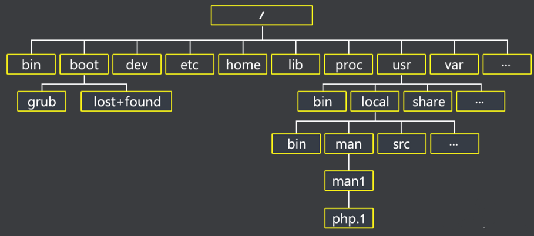
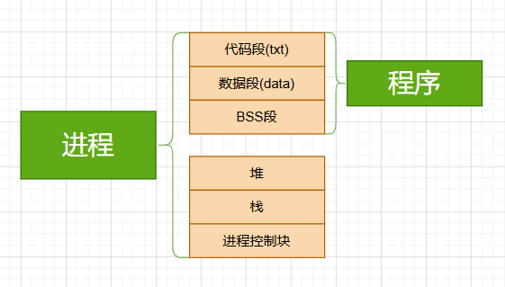
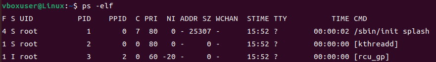

-linux操作系统的基础知识,操作等

# linux基础操作

## 一.文件结构



| 目录            | 作用说明                                                |
| --------------- | ------------------------------------------------------- |
| `/`             | 根目录，所有文件和目录的起点                            |
| `/bin`          | 存放基本命令（如 `ls`, `cp`, `mv`），所有用户都可用     |
| `/sbin`         | 系统管理员使用的系统管理命令（如 `reboot`, `ifconfig`） |
| `/etc`          | 配置文件目录（如网络、用户、服务配置）                  |
| `/home`         | 普通用户的主目录（如 `/home/alice`）                    |
| `/root`         | 超级用户（root）的主目录                                |
| `/usr`          | 用户级应用程序和文件（如 `/usr/bin`, `/usr/lib`）       |
| `/var`          | 可变数据，如日志文件（`/var/log`）、邮件、缓存等        |
| `/tmp`          | 临时文件目录，系统重启后可能会清空                      |
| `/dev`          | 设备文件（如硬盘、终端、USB 设备）                      |
| `/proc`         | 虚拟文件系统，提供内核和进程信息                        |
| `/sys`          | 另一个虚拟文件系统，提供系统硬件信息                    |
| `/lib`          | 系统启动和基本命令所需的共享库                          |
| `/boot`         | 启动相关文件（如内核、GRUB 引导器）                     |
| `/mnt` `/media` | 挂载外部设备（如 U 盘、CD-ROM）                         |
| `/opt`          | 可选软件包安装位置（如第三方应用）                      |
| `/srv`          | 提供服务的数据目录（如 Web 或 FTP 服务）                |

---


## 二.常用命令

> help+命令  可以查看相关命令的帮助信息

### 文件目录与操作

| 命令  | 作用说明         | 常用参数说明                                        |
| ----- | ---------------- | --------------------------------------------------- |
| ls    | 列出目录内容     | `-l` 详细列表；`-a` 显示隐藏文件；`-h` 人类可读大小 |
| cd    | 切换目录         | 无参数；使用 `..` 返回上一级                        |
| pwd   | 显示当前路径     | 无参数                                              |
| mkdir | 创建目录         | `-p` 创建多级目录                                   |
| rm    | 删除文件或目录   | `-r` 递归删除；`-f` 强制删除                        |
| cp    | 复制文件或目录   | `-r` 复制目录；`-i` 覆盖前提示                      |
| mv    | 移动或重命名     | `-i` 覆盖前提示；`-n` 不覆盖已存在文件              |
| touch | 创建空文件       | 无参数                                              |
| find  | 查找文件         | `-name` 按名称查找；`-type` 按类型查找              |
| tree  | 树状显示目录结构 | `-L` 限制显示层级；`-d` 仅显示目录                  |


### 文件内容查看与编辑

| 命令 | 作用说明                         | 常用参数说明                                                 |
| ---- | -------------------------------- | ------------------------------------------------------------ |
| cat  | 查看文件内容                     | `-n` 显示行号；`-A` 显示不可见字符                           |
| more | 分页查看文件                     | 空格翻页；`q` 退出                                           |
| less | 分页查看文件                     | 上下翻页；`/关键字` 搜索                                     |
| head | 查看前几行                       | `-n` 指定行数（默认10）                                      |
| tail | 查看最后几行                     | `-n` 指定行数；`-f` 实时跟踪文件变化                         |
| nano | 简易文本编辑器                   | `Ctrl+O` 保存；`Ctrl+X` 退出                                 |
| vim  | 高级文本编辑器                   | `i` 插入模式；`:wq` 保存退出；`:q!` 强制退出                 |
| grep | 在文本中**搜索符合某种模式的行** | `-n`显示匹配行号;`-i`忽略大小写;`-v`反向匹配(先面试不匹配的行)<br />`-r`递归搜素目录下所有文件;`-l`只搜素匹配文件名;`-c`统计匹配的行数 |


### 用户与权限


| 命令    | 作用说明       | 常用参数说明                          |
| ------- | -------------- | ------------------------------------- |
| whoami  | 显示当前用户   | 无参数                                |
| su      | 切换用户       | `-` 切换到完整环境                    |
| sudo    | 管理员权限执行 | `-s` 打开 root shell；`-u` 指定用户   |
| chmod   | 修改权限       | `+x` 添加执行权限；`755` 数字权限设置 |
| chown   | 修改所有者     | `user:group` 格式；`-R` 递归修改      |
| passwd  | 修改密码       | 无参数                                |
| useradd | 添加用户       | `-m` 创建主目录；`-s` 指定 shell      |
| userdel | 删除用户       | `-r` 删除主目录                       |


### 软件包管理

| 命令        | 作用说明       | 常用参数说明                          |
| ----------- | -------------- | ------------------------------------- |
| apt update  | 更新软件列表   | 无参数                                |
| apt upgrade | 升级已安装软件 | `-y` 自动确认                         |
| apt install | 安装软件包     | `-y` 自动安装；`--reinstall` 重新安装 |
| apt remove  | 卸载软件包     | `--purge` 删除配置文件                |
| dpkg -i     | 安装本地包     | 安装 `.deb` 文件                      |


### 系统状态与资源监控

| 命令   | 作用说明                   | 常用参数说明                                                 |
| ------ | -------------------------- | ------------------------------------------------------------ |
| top    | 实时资源监控(动态信息)     | `q` 退出；`h` 帮助;`Shift`+`>`后翻页;`Shift`+`<`前翻页;`-p PID`查看某个进程 |
| htop   | 友好资源监控               | `F6` 排序方式；`F9` 杀死进程                                 |
| free   | 查看内存使用               | `-h` 人类可读格式                                            |
| df     | 查看磁盘使用               | `-h` 人类可读格式；`-T` 显示文件系统类型                     |
| du     | 查看文件大小               | `-h` 人类可读；`-s` 总计；`--max-depth` 限制层级             |
| uptime | 查看运行时间               | 无参数                                                       |
| ps     | 查看系统进程快照(静态信息) | `-ef` 显示所有进程；`aux` 传统格式;`-l`长格式显示更加详细的信息 |
| kill   | 终止进程                   | `-9` 强制终止；使用 PID                                      |

### 网络相关

| 命令     | 作用说明     | 常用参数说明                        |
| -------- | ------------ | ----------------------------------- |
| ping     | 测试网络连接 | `-c` 指定次数；`-i` 间隔时间        |
| ifconfig | 查看网络接口 | `eth0`, `lo` 等接口名（旧版命令）   |
| ip a     | 查看 IP 地址 | `ip addr` 的简写                    |
| netstat  | 查看连接状态 | `-tuln` 查看监听端口；`-p` 显示进程 |
| curl     | 网络请求工具 | `-I` 查看响应头；`-O` 下载文件      |
| wget     | 下载工具     | `-c` 断点续传；`-O` 指定输出文件名  |
| ssh      | 远程登录     | `user@host` 格式；`-p` 指定端口     |

### 连接符号

| 符号   | 含义                        | 等价的系统级操作                 |
| ------ | --------------------------- | -------------------------------- |
| `>`    | 标准输出重定向（覆盖写）    | 把 FD1 指向一个新文件            |
| `>>`   | 标准输出追加                | 把 FD1 指向文件末尾              |
| `<`    | 标准输入重定向              | 把 FD0 改为从文件读              |
| `2>`   | 错误输出重定向              | 把 FD2 改为文件                  |
| `2>>`  | 错误输出追加                | FD2 追加写入                     |
| `2>&1` | 合并输出与错误流            | 把错误输出重定向到标准输出的位置 |
| `&>`   | 同时重定向 stdout 和 stderr | 等价于 `>file 2>&1`              |
| `|`    | 管道符`|`                   | 左边命令的输出作为右边命令的输入 |
| `&&`   | 逻辑与                      | 前一个命令成功时执行后一个       |
| `;`    | 顺序执行                    | 不论前一个是否成功               |
| `&`    | 后台执行                    | 命令放入后台运行                 |
| `()`   | 子 Shell                    | 在新进程中执行命令               |
| `{}`   | 当前 Shell                  | 在当前 Shell 中执行复合命令      |

---


## 三.Nano和Vim编辑器

>  **Vim 是功能强大的多模式编辑器，Nano 是简单易用的命令行文本编辑器。Vim 适合高级用户，Nano 更适合初学者。下面是两者的基本用法和常用快捷键。**

### Vim 编辑器用法（Vi IMproved）

Vim 是一种**多模式编辑器**，主要有三种模式：

- **普通模式（Normal）**：默认进入，用于导航和执行命令
- **插入模式（Insert）**：用于输入文本，按 `i` 进入
- **命令模式（Command）**：用于保存、退出等操作，按 `:` 进入

🔧 基本操作

```
  vim filename.txt       # 打开或创建文件
```

- `i` → 进入插入模式
- `Esc` → 返回普通模式
- `:w` → 保存文件
- `:q` → 退出 Vim
- `:wq` 或 `ZZ` → 保存并退出
- `:q!` → 强制退出不保存

📌 常用命令

| 命令         | 说明              |
| ------------ | ----------------- |
| `:set nu`    | 显示行号          |
| `dd`         | 删除当前行        |
| `yy`         | 复制当前行        |
| `p`          | 粘贴              |
| `/keyword`   | 搜索关键字        |
| `:syntax on` | 开启语法高亮      |
| `:help`      | 查看 Vim 帮助文档 |


📚 更多技巧可参考 [Vim Cheat Sheet](https://vim.rtorr.com/) 或 [Command in Line 教程](https://www.commandinline.com/linux/vim-editor-commands-and-cheat-sheet-guide/)。


### Nano 编辑器用法

> Nano 是一个**轻量级、易上手**的命令行文本编辑器，适合快速编辑配置文件或脚本。

🔧 基本操作

```
nano filename.txt      # 打开或创建文件
```

- 编辑后按 `Ctrl+O` → 保存
- 按 `Enter` → 确认文件名
- 按 `Ctrl+X` → 退出
- 按 `Ctrl+K` → 剪切当前行
- 按 `Ctrl+U` → 粘贴
- 按 `Ctrl+W` → 搜索
- 按 `Ctrl+\` → 替换

📌 常用快捷键

| 快捷键   | 说明                   |
| -------- | ---------------------- |
| `Ctrl+G` | 显示帮助               |
| `Ctrl+C` | 显示光标位置           |
| `Ctrl+T` | 拼写检查（需安装词典） |
| `Alt+U`  | 撤销                   |
| `Alt+E`  | 重做                   |

📚 更多用法参考 [Linuxize 教程](https://linuxize.com/post/how-to-use-nano-text-editor/) 或 [CommandMasters 指南](https://commandmasters.com/commands/nano-common/)。


---


## 四.Shell脚本编程

### 1.基本结构

```bash
#!/bin/bash         # 指定解释器（Shebang）
echo "Hello World"  # 输出语句
```

- 第一行 `#!/bin/bash` 是必须的，告诉系统用 Bash 来执行脚本。
- 使用 `chmod +x script.sh` 赋予执行权限。
- 执行方式：`./script.sh` 或 `bash script.sh`

### 2.变量

---


**2.1 普通变量**:

```bash
name="Alice"        # 定义变量（等号两边不能有空格）
echo $name          # 使用变量
```

- Shell变量不区分类型,同一解释为字符串
- 使用`$变量名`来调用变量
- `unset 变量名`删除变量

**2.2 位置变量**

| 变量名   | 含义                                                   |
| -------- | ------------------------------------------------------ |
| $0       | Shell脚本本身的名字(实际是路径),与你命令行传入路径一样 |
| $1....$9 | 传递的第n个参数                                        |
| $#       | 命令行参数的个数                                       |
| $@       | 包含所有命令行参数：“$1 $2……$9”以空格分隔              |
| $*       | 同$*                                                   |
| $$       | 包含正在执行进程的ID号                                 |


**2.3 环境变量**


用户与身份相关

| 环境变量 | 说明                       | 示例值      |
| -------- | -------------------------- | ----------- |
| USER     | 当前用户名                 | alice       |
| HOME     | 当前用户的主目录           | /home/alice |
| UID      | 当前用户的用户 ID          | 1000        |
| SHELL    | 默认使用的 Shell 程序      | /bin/bash   |
| LOGNAME  | 登录名（通常与 USER 相同） | alice       |

---

路径与目录相关

| 环境变量 | 说明                | 示例值           |
| -------- | ------------------- | ---------------- |
| PATH     | 可执行文件搜索路径  | /usr/bin:/bin    |
| PWD      | 当前工作目录        | /home/alice/docs |
| OLDPWD   | 上一次工作目录      | /home/alice      |
| CDPATH   | `cd` 命令的搜索路径 | .:~              |

---

系统与终端相关

| 环境变量 | 说明               | 示例值         |
| -------- | ------------------ | -------------- |
| HOSTNAME | 当前主机名         | ubuntu-server  |
| TERM     | 当前终端类型       | xterm-256color |
| LANG     | 当前语言与编码设置 | en_US.UTF-8    |
| TZ       | 时区设置           | Asia/Shanghai  |

---

程序执行相关

| 环境变量 | 说明                   | 示例值          |
| -------- | ---------------------- | --------------- |
| PS1      | 主提示符（命令行样式） | \u@\h:\w\$      |
| PS2      | 次提示符（多行命令）   | >               |
| MAIL     | 用户邮箱路径           | /var/mail/alice |
| EDITOR   | 默认文本编辑器         | vim             |
| HISTFILE | 历史记录文件路径       | ~/.bash_history |
| HISTSIZE | 历史记录保存条数       | 1000            |

---


### 3.条件与循环

```bash
if [ $age -ge 18 ]; then #注意方括号中的空格
  echo "Adult"
else
  echo "Minor"
fi
```

- `-eq` 等于
-  `-ne`不等于，
- `-gt`大于，
- `-lt`小于
- 字符串判断：`=`, `!=`, `-z`（空），`-n`（非空）
- 文件判断：`-f` 文件，`-d` 目录，`-e` 存在

循环

```bash
for i in {1..5}; do
  echo "Number $i"
done

while [ $count -lt 5 ]; do
  echo $count
  ((count++))
done

# The statement of for…do…done
if  [  !  -d  $HOME/backup  ]
then
	mkdir  $HOME/backup
fi
flist=`ls`
for  file  in  $flist
do
	if   [  $#  =  1  ]
	then
		if   [  $1  =  $file  ]
		then
			echo  "$file  found" ;  exit
		fi
	else
		cp  $file  $HOME/backup
		echo  "$file  copied"
	fi
done
echo   ***Backup  Completed***

```

### 4.函数

```bash
check_user( )    
{  #查找已登录的指定用户
 	 user=`who  |  grep  $1 | wc -l`
       	if [ $user –eq 0 ]
      	 	then
              		return  0       #未找到指定用户
       	else
             	        return  1       #找到指定用户
       	fi
}
while  true         # MAIN, Main, main:   program  begin  here
do
	echo  "Input username: \c"
	read   uname
	check_user  $uname       # 调用函数, 并传递参数uname
	if [ $? –eq  1 ]                 # $?为函数返回值
	then	echo  "user  $uname  online"
	else	echo  "user  $uname  offline"
	fi
done


Scope()
{	
Local lclvariable =1  #声明局部变量
Gblvariable = 2
echo “lclavariable in function = $ lclvariable ” 
echo “Gblvariable in function = $ Gblvariable ”
}
```


# linux进阶


## 一.文件

> 在 Linux 眼里，**万物皆文件（Everything is a file）**。
>  不仅是我们平常理解的文本、图片、可执行程序，
>  连这些看起来“不像文件”的东西——
>
> - 硬件设备（如 `/dev/ttyS0`、`/dev/sda`）
> - 进程信息（如 `/proc/1/status`）
> - 内核接口（如 `/sys/class/gpio/`）
> - 套接字与管道（socket、pipe）
>    也都以“文件”的形式被系统管理

linux的设计哲学是:`用一个统一的接口（文件操作）去访问不同类型的资源。`

只要能被抽象成“文件”，
 那么它就可以被同一组系统调用访问，比如：

```c
open()
read()
write()
close()
ioctl()
```

无论你在读一个普通文本文件；往串口 `/dev/ttyUSB0` 写数据；或通过 `/sys` 改变内核参数；调用接口都是一样的。

Linux 的文件系统中，常见文件类型包括：

| 类型                      | 示例                            | 含义                     |
| ------------------------- | ------------------------------- | ------------------------ |
| 普通文件                  | `/etc/passwd`, `/home/user/a.c` | 数据或程序文件           |
| 目录（Directory）         | `/etc`, `/usr/bin`              | 文件集合（相当于文件夹） |
| 符号链接（Symbolic link） | `/lib -> /usr/lib`              | 类似快捷方式             |
| 字符设备文件              | `/dev/tty`, `/dev/led0`         | 以字节为单位访问硬件     |
| 块设备文件                | `/dev/sda`, `/dev/mmcblk0`      | 以块为单位访问磁盘类设备 |
| 套接字（Socket）          | `/run/systemd/private`          | 进程间通信               |
| 管道（FIFO）              | `/tmp/mypipe`                   | 一种特殊通信文件         |

**1. 文件的存储结构**

Linux 的文件系统（例如 ext4、xfs）底层并不直接“存文件”，
而是用 **inode + data block** 的结构：

| 元素                  | 含义                                       |
| --------------------- | ------------------------------------------ |
| **inode（索引节点）** | 存放文件的元信息（权限、时间、数据块位置） |
| **data block**        | 存放文件的实际内容                         |

可以理解为

```rust
文件名  -> inode号 -> 数据块位置
```

命令 `ls -i` 就能看到文件对应的 inode 号。
而 `stat filename` 可以查看它的 inode 内容。

**2.文件与进程的关系**

当一个进程打开一个文件时，系统会为它建立一个**文件描述符（file descriptor, FD）**。
这是一个整数，用来表示一个已打开的文件对象,它是进程内部用于标识已打开文件的索引。
每个进程都有一个**文件描述符表**来管理已经打开的文件,内核通过文件描述符来操作对应的文件和设备。


进程启动时,会自动创建3个标准描述符：

| FD   | 含义            | 默认设备 |
| ---- | --------------- | -------- |
| 0    | 标准输入 stdin  | 键盘     |
| 1    | 标准输出 stdout | 终端屏幕 |
| 2    | 标准错误 stderr | 终端屏幕 |

所以重定向本质是改写 FD 映射：

```bash
ls > out.txt   # 把标准输出重定向到文件out.txt中,既把ls命令返回的文件内容输入到文件中
ls 2> err.txt  # 把错误重定向
```


## 二.进程

###　2.1**进程和程序的区别**

> 程序是代码,而进程是程序的执行副本。
>
> 当运行一个程序时,内核会把他加载到内存,建立PCB(进程控制块),这才成为一个进程

| 项目     | 程序（Program）                      | 进程（Process）                        |
| -------- | ------------------------------------ | -------------------------------------- |
| 定义     | 存储在磁盘上的可执行文件（静态实体） | 程序在内存中被执行的实例（动态实体）   |
| 存储位置 | 磁盘（文件系统）                     | 内存（RAM）                            |
| 资源占用 | 不占用系统资源                       | 拥有独立的地址空间、寄存器状态、堆栈等 |
| 标识     | 文件路径                             | 进程号（PID）                          |




### 2.2**PCB(进程控制块)**

每个进程在内核中有对应的 `task_struct` 结构体（PCB），它包含：

- 进程号（PID）

- 程序计数器（PC）

- 寄存器上下文

- 进程状态

- 内存映射（代码段、数据段、堆、栈）

- 打开的文件描述符表（FD Table）

- 信号处理函数表

- 父子进程关系指针

也就是说，内核通过 `task_struct` 来完整描述和管理一个进程的生命期。

### 2.3**进程的五种基本状态**

> 僵尸进程依然占据 PID，只是资源已释放，若父进程不 `wait()`，它会一直残留。

| 状态         | 英文缩写              | 含义                                           |
| ------------ | --------------------- | ---------------------------------------------- |
| 运行态       | `R` (Running)         | 正在 CPU 上执行或在就绪队列中等待              |
| 可中断睡眠   | `S` (Sleeping)        | 等待事件（如 I/O 完成），可被信号唤醒          |
| 不可中断睡眠 | `D` (Uninterruptible) | 等待硬件响应（例如磁盘、驱动），不能被信号中断 |
| 停止态       | `T` (Stopped)         | 收到 SIGSTOP / 调试中断而暂停                  |
| 僵尸态       | `Z` (Zombie)          | 子进程结束但父进程尚未回收其退出状态           |

### 2.4**进程类型**

- `交互进程`：在shell下启动。以在`前台`运行，也可以在后台运行
- `批处理进程`：和在终端无关，被提交到一个`作业队列`中以便顺序执行
- `守护进程`：和终端无关，一直在`后台`运行

### 2.5**PS命令**

> 查看系统进程快照
>
> -e：显示所有进程 -l：长格式显示更加详细的信息 -f 全部列出，通常和其他选项联用
>
> `ps -elf|grep 进程名`：查看与`进程名相同`的所有进程的信息




| 参数  | 含义                                                         |
| ----- | ------------------------------------------------------------ |
| F     | 进程标志，说明进程的权限，常见的标志有两个: 1：进程可以被复制，但是不能被执行；4：进程使用超级用户权限 |
| S     | 进程状态。进程状态。常见的状态有以下几种：**1.-D**：不可被唤醒的睡眠状态，通常用于 I/O 情况。**2.-R**：该进程正在运行。**3.-S**：该进程处于睡眠状态，可被唤醒。**4.-T**：停止状态，可能是在后台暂停或进程处于除错状态。**5.-W**：内存交互状态（从 2.6 内核开始无效）。**6.-X**：死掉的进程（应该不会出现）。**7.-Z**：僵尸进程。进程已经中止，但是部分程序还在内存当中。**8.-<**：高优先级（以下状态在 BSD 格式中出现）。**9.-N**：低优先级。**10.-L**：被锁入内存。**11.-s**：包含子进程。**12.-l**：多线程（小写 L）。**13.-+**：位于后台。<br/> |
| UID   | 运行此进程的用户的 ID                                        |
| PID   | 进程的 ID                                                    |
| PPID  | 父进程的 ID                                                  |
| C     | 该进程的 CPU 使用率，单位是百分比                            |
| PRI   | 进程的优先级，数值越小，该进程的优先级越高，越早被 **CPU** 执行,由内核根据各种属性(包括NI)计算得出的值<br />直接决定了CPU调度的顺序 |
| NI    | 进程的优先级，数值越小，该进程越早被执行,是由用户调整的一个值 |
| ADDR  | 该进程在内存的哪个位置                                       |
| SZ    | 该进程占用多大内存                                           |
| WCHAN | 该进程是否运行。"-"代表正在运行                              |
| STIME | 进程的启动时间                                               |
| TTY   | 该进程由哪个终端产生                                         |
| TIME  | 该进程占用 CPU 的运算时间，注意不是系统时间                  |
| CMD   | 产生此进程的命令名                                           |

### 2.6**前后台进程切换**

- `jobs` : 查看后台进程
- `bg` : 将`挂起的进程`在后台运行
- `fg` : 把后台运行的进程`放到前台运行`
- `ctrl+z` : 把运行的前台进程转为后台并停止。
- `./test &` : 把test程序后台运行

### 2.7**改变进程优先级**

`nice`-按用户指定的优先级运行进程

```bash
nice [-n NI值] 命令
```

- NI 范围是 `-20~19`。`数值越大`优先级`越低`
- `普通用户`调整 `NI` 值的范围是 `0~19`，而且只能调整自己的进程。
- `普通用户`只能`调高` `NI` 值，而不能降低。如原本 NI 值为 0，则只能调整为大于 0。
- 只有 `root` 用户才能设定进程 NI 值为`负值`，而且可以调整任何用户的进程。

`renice` -改变正在运行进程的优先级

```bash
renice [优先级] PID
```


### 2.8**进程组**

> 在 Linux 内核中，**每个进程都有一个 `pgid`（Process Group ID）**。
>  一组具有相同 `pgid` 的进程构成一个**进程组**。
>
> 进程组时内核中用于同一管理一批相关进程的逻辑集合

Linux 使用进程组来区分：

- 哪些进程属于同一个“作业（job）”；
- 哪个进程组是当前终端的前台作业（Foreground Process Group）；
- 信号（如 Ctrl+C → SIGINT）应该发给哪一组进程。

---


### 三.线程

#### 3.1线程的本质

在 Linux 中，**线程本质上就是一种轻量级的进程（LWP, Light Weight Process）**。
从内核角度看：**线程和进程并无本质区别，二者都是“task_struct”结构的实例。**

区别仅在于**资源共享程度**：

| 资源项        | 进程     | 线程                          |
| ------------- | -------- | ----------------------------- |
| 虚拟地址空间  | 独立     | 共享                          |
| 文件描述符表  | 独立     | 共享                          |
| 堆与全局变量  | 独立     | 共享                          |
| 栈（Stack）   | 各自独立 | 各自独立                      |
| PID（任务ID） | 独立     | 各自有 TID，但共享同一 PID 组 |

线程相当于“**多个执行流共享同一个进程的内存空间**”。

####　3.2线程与CPU的关系

在调度层面上，**线程是CPU调度的最小单位**。
Linux 的内核调度器（CFS）不会区分“进程”或“线程”，
调度的是统一的结构体：`task_struct`。

这意味着：

- 每个线程都有自己的调度状态（就绪、运行、阻塞等）；
- 但同一进程的多个线程可以**并发运行**在多核 CPU 上；
- 它们共享同一片内存空间，因此通信效率高。

#### 3.3线程的优势与风险

优势：

- **通信开销低**：共享内存，无需 IPC；
- **创建/销毁成本低**：无需完整的地址空间复制；
- **多核并行性好**：天然适合多任务并行计算。

风险：

- **数据竞争（Race Condition）**：多个线程同时读写共享变量；
- **死锁（Deadlock）**：多个锁循环等待；
- **同步复杂**：需要显式使用互斥锁（mutex）、信号量（semaphore）等机制。

在嵌入式系统中：

线程常用于**后台数据采集、通信任务、显示刷新、控制逻辑**等并行执行；

但要注意：共享资源时必须使用同步机制，否则很容易出“读写冲突”问题；

在实时任务中，有时反而**避免多线程**，改用**事件循环**以保证可预测性。


---


### 四.信号

> 信号是在软件层次上对中断机制的一种模拟,是一种异步事件通知机制
>
> 所有信号的产生及处理全都是由内核完成的
>
> 是Linux内核与进程之间进行事件传递的一种方式
>
> 有关信号的详细内容使用下面命令查看(包括所有的信号类型,内核对信号的处理命令等)
>
> > ```bash
> > man 7 signal
> > ```

#### 4.1信号的本质

> 每个进程在内核中都有一个 `task_struct` 结构体PCB()，其中包含：
>
> - 当前信号状态
> - 信号屏蔽字（哪些信号被阻塞）
> - 信号处理函数（若注册）
>
> 当一个信号到达时，**内核只是在进程控制块中打上标记**（pending）。
>  真正的执行，要等到进程被调度运行时检查这些标志。

简要流程如下:

1. 每个信号对应一个编号(如:SIGINT=2,SIGKIL=9)
2. 当信号产生后,内核在进程的PCB中设置一个标志位
3. 进程一旦从内核态返回用户态,活在调度点被唤醒,就会检查改该志
4. 若该信号注册了处理函数(handler),则调用它,否则执行信号的默认操作(终止,忽略,停止,继续)
5. 信号是异步的,它随时可能打断当前的执行流,就像中断打断CPU

---


#### 4.2常见信号及作用

| 类别         | 代表信号                                             | 作用                                   |
| ------------ | ---------------------------------------------------- | -------------------------------------- |
| 程序控制类   | `SIGINT`, `SIGTERM`, `SIGKILL`, `SIGSTOP`, `SIGCONT` | 终止、暂停、恢复进程                   |
| 错误类       | `SIGSEGV`, `SIGFPE`, `SIGILL`, `SIGBUS`              | 表示程序运行错误（段错误、非法指令等） |
| I/O 事件类   | `SIGPIPE`, `SIGIO`, `SIGURG`                         | 文件描述符事件或网络事件               |
| 用户自定义类 | `SIGUSR1`, `SIGUSR2`                                 | 程序员可自定义使用                     |
| 子进程状态类 | `SIGCHLD`                                            | 子进程结束时通知父进程                 |

| 信号名    | 含义                                                         | 默认操作 |
| --------- | ------------------------------------------------------------ | -------- |
| SIGHUP    | 该信号在用户终端关闭时产生，通常是发给和该终端关联的会话内的所有进程 | 终止     |
| SIGINT    | 该信号在用户键入INTR字符(Ctrl-C)时产生，内核发送此信号送到当前终端的所有前台进程 | 终止     |
| SIGQUIT   | 该信号和SIGINT类似，但由QUIT字符(通常是Ctrl-)来产生          | 终止     |
| SIGILL    | 该信号在一个进程企图执行一条非法指令时产生                   | 终止     |
| SIGSEV    | 该信号在非法访问内存时产生，如野指针、缓冲区溢出             | 终止     |
| SIGPIPE   | 当进程往一个没有读端的管道中写入时产生，代表“管道断裂”       | 终止     |
| SIGTERM   | 系统默认结束进程,但用户也可自定义程序如何响应(如作一些收尾工作),是一种礼貌的终止请求 | 终止     |
| SIGKILL   | 该信号用来结束进程，并且不能被捕捉和忽略                     | 终止     |
| SIGSTOP   | 该信号用于暂停进程，并且不能被捕捉和忽略                     | 暂停进程 |
| SIGTSTP   | 该信号用于暂停进程，用户可键入SUSP字符(通常是Ctrl-Z)发出这个信号 | 暂停进程 |
| SIGCONT   | 该信号让进程进入运行态                                       | 继续运行 |
| SIGALRM   | 该信号用于通知进程定时器时间已到                             | 终止     |
| SIGUSR1/2 | 该信号保留给用户程序使用                                     | 终止     |
| SIGCHLD   | 是子进程状态改变发给父进程的                                 | 忽略     |

举例

1.  按 `Ctrl + C` 时，终端会向前台进程组发送 `SIGINT` 信号。
    → 默认动作：终止进程。

2.  按 `Ctrl + Z` 时，发送 `SIGTSTP`。
    → 默认动作：暂停进程。

3. 子进程结束后，会给父进程发 `SIGCHLD`。
    → 父进程可调用 `wait()` 或 `waitpid()` 回收资源。

4.  程序非法访问内存（如野指针）时，内核发出 `SIGSEGV`。
    → 默认动作：终止并生成 core dump。

---


#### 4.3信号的生命周期

> 从时间发生到进程被打断的整个路径了解信号的流程

1. **信号产生(Generation)**

   信号的产生有以下来源:

   | 来源       | 示例                                             |
   | ---------- | ------------------------------------------------ |
   | 硬件事件   | 除零错误触发 `SIGFPE`，段错误触发 `SIGSEGV`      |
   | 内核事件   | 子进程结束触发父进程 `SIGCHLD`                   |
   | 用户输入   | 终端发送 `SIGINT`（Ctrl+C）、`SIGTSTP`（Ctrl+Z） |
   | 系统调用   | `kill(pid, SIGUSR1)`、`pthread_kill()`           |
   | 定时器到期 | `SIGALRM`、`SIGVTALRM`                           |

​		此时信号进入目标进程的“**待处理信号队列**”中（pending queue）。

2. **信号登记(Pending)**

​		在`task_struct`中,Linux用一个bitmap(信号位图)表示当前有哪些信号待处理

```c
struct task_struct {
    ...
    sigset_t pending;  // 等待处理的信号
    sigset_t blocked;  // 被屏蔽的信号
    ...
};
```

​	 如果信号当前在 `blocked` 集合中，则暂时不会被处理；

​	 如果信号未被屏蔽，则标志位被设置后，一旦返回用户态或在调度点，内核就会处理。

3. **信号传递(Delivery)**

当进程被唤醒或从系统调用返回时，内核检查 `pending` 集合：若有未屏蔽信号，则进入“信号处理阶段”。

处理逻辑有三种情况：

1. 若信号被设为 **忽略（SIG_IGN）** → 丢弃；
2. 若信号为 **默认处理（SIG_DFL）** → 按内核定义执行（终止、暂停、继续等）；
3. 若信号注册了自定义 handler（用户态函数）→ 内核修改栈帧，让进程暂时执行 handler。

这就像内核“劫持”了进程执行流，强制它去执行你的信号函数。

4. **信号处理(Handling)**

执行用户定义或默认操作

例如:

`SIGKILL`、`SIGSTOP` 无法捕获、无法屏蔽 → 直接强制终止或停止；

`SIGSEGV` → 默认是终止进程并生成 core dump；

`SIGCHLD` → 通知父进程有子进程结束。

一旦执行完Handler,进程的执行流会**恢复**到被打断处(就像一次中断返回)。

总结:

| 阶段 | 关键点                                  |
| ---- | --------------------------------------- |
| 产生 | 内核或进程触发信号事件                  |
| 登记 | 在进程 PCB 中设置 pending 标志          |
| 传递 | 内核调度或返回用户态时检测 pending 信号 |
| 处理 | 执行默认或自定义处理逻辑                |
| 恢复 | 返回原用户态执行流                      |

---


#### 4.4信号与中断

> 信号 ≈ 用户态的中断机制。

| 对比点   | 中断（Interrupt）  | 信号（Signal）               |
| -------- | ------------------ | ---------------------------- |
| 发生层级 | 内核态             | 用户态                       |
| 触发源   | 硬件事件           | 软件事件（内核、进程、终端） |
| 处理位置 | 中断上下文（ISR）  | 用户态信号处理函数           |
| 响应时机 | 立即（中断CPU）    | 被调度或返回用户态时检查     |
| 响应代价 | 较高（切换内核栈） | 较低（上下文保存/恢复）      |

异步信号：例如 `SIGINT`、`SIGCHLD`，随时可能出现；

同步信号：例如 `SIGSEGV`、`SIGFPE`，由当前进程指令执行引发。

异步信号意味着它打断程序执行；
同步信号意味着程序自己触发错误。

---

#### 4.5信号处理命令

> Linux提供了几类命令:
>
> **查看信号种类及编号**
>
> **向进程发送信号**
>
> **查看进程收到的信号**

1. **查看信号类型和编号**

   查看所有信号及其编号

   ```bash
   kill -l
   #输出:1) SIGHUP	 2) SIGINT	 3) SIGQUIT	 4) SIGILL	 5) SIGTRAP
   # 6) SIGABRT	 7) SIGBUS	 8) SIGFPE	 9) SIGKILL....
   #
   ```

   

2. **向进程发送信号**

   通过PID向进程发送信号（默认发送 `SIGTERM`）：

   ```bash
   kill kill [-signal] pid
   kill <pid>         #默认SIGTERM终止进程
   #指定信号,可以用名字,也可以用编号
   kill -9 <pid>      # 强制杀死进程 -9对应SIGKILL
   kill -SIGSTOP <pid>  # 暂停进程
   kill -SIGCONT <pid>  # 恢复进程
   ```

   通过**进程名**发送信号：

   ```bash
   pkill -9 firefox    # 杀死所有名为 firefox 的进程
   pkill -STOP myprog  # 暂停所有 myprog 进程
   pkill -CONT myprog  # 恢复所有 myprog 进程
   ```

   一键结束同名进程:

   相比kill风险更高,可能终止错误的进程

   类似于 `pkill`，但语义略不同

   ```bash
   #killall killall [选项] [信号] <进程名> 
   #-i选项会在终止每个进程前向你确认,-I选项可以忽略进程名的大小写
   #-w 选项会让 killall 等待，直到所有被发送信号的进程都真正结束为止。
   #-l一样用于查看所有信号极其编号
   killall myprogram#默认也是发送SIGTERM信号
   killall -9 myprogram#强制终止
   ```

   

3. **查看进程收到的信号**

   追踪某个程序在运行过程中收发的信号

   ```bash
   strace -e trace=signal ./myprog
   #输出示例:--- SIGINT {si_signo=SIGINT, si_code=SI_USER, si_pid=1234, si_uid=1000} ---收到SIGINT信号
   ```

   ​	

4. **管理前后台任务**

   ```
   # Ctrl+Z 暂停当前任务（发送 SIGTSTP）
   bg          # 让暂停的任务后台继续运行（发送 SIGCONT）
   fg          # 将后台任务调回前台
   jobs        # 查看后台任务状态
   ```


---


#### 4.6信号的默认动作

> 用户在未注册处理函数时,信号将触发默认动作
>
> 默认动作在`man 7 signal`信号表格的Action列查看

所有的默认动作如下:

| Action | 描述                                                   |
| ------ | ------------------------------------------------------ |
| Term   | 终止进程                                               |
| Ign    | 忽略该信号                                             |
| Core   | 默认操作是终止进程并转储核心转储文件（参见 core(5)）。 |
| Stop   | 暂停进程                                               |
| Cont   | 如果进程被停止就继续该进程                             |

### 五.消息队列

> 消息队列是一种内核维护的消息链表，每条消息都带有一个类型和一段数据，多个进程可以通过系统调用往队列中写入或读取消息。

不像管道那样必须是字节流（谁先写谁先读），消息队列允许你发送有意义的结构化消息。

假设你有两个进程：

- 进程 A（客户端）要发多个任务请求
- 进程 B（服务端）负责接收并处理这些任务

你可以让它们通过一个消息队列通信：

| 消息类型 | 内容                 |
| -------- | -------------------- |
| 1        | “计算 3+5”           |
| 2        | “读取温度传感器数据” |
| 3        | “退出”               |

进程 A 可以把这些消息发送进去；
进程 B 可以按“类型”取出不同任务执行。
整个过程就像一个“邮箱”一样存在于内核空间。

你可以使用`ipcs -q`命令显示当前存在的System V消息队列

`ipcrm -q <msqid>`来删除一个消息duilie

Linux系统中有两种消息队列标准:

**(1)System V消息队列**

这是 **早期 UNIX 时代就有的老接口**，通过 `<sys/msg.h>` 提供。

- 每个队列都有唯一的 key（通过 `ftok()` 生成）。
- 通过 `msgget()` 创建或获取队列。
- 用 `msgsnd()` 发送消息。
- 用 `msgrcv()` 接收消息。
- 用 `msgctl()` 控制（删除/获取状态等）。

> 这种接口比较“古老”，但稳定可靠，很多嵌入式 Linux 仍在用。

**(2)POSIX消息队列**

是后来标准化的新接口，通过 `<mqueue.h>` 提供。

- 队列通过名字（如 `"/myqueue"`）标识。
- 用 `mq_open()` 打开/创建。
- 用 `mq_send()`、`mq_receive()` 通信。
- 用 `mq_close()`、`mq_unlink()` 管理。

> 它支持**优先级**、**非阻塞 I/O**、**异步通知**等更现代的特性。
>  但是需要内核支持 POSIX 消息队列（大多数 Linux 发行版都支持）。

**从底层来看,当你创建一个消息队列时:**

(1)**内核分配一个队列对象**（在内核 IPC 表中登记）；

(2)每条消息在队列内部是一个链表节点，结构大致包括：

- 消息类型（`long msg_type`）
- 消息体（`char msg_text[]`）
- 消息长度、时间戳、发送者 PID 等元信息；

(3)当你 `msgsnd()` 时，数据被复制到内核；

(4)当另一个进程 `msgrcv()` 时，内核把对应类型的消息拷贝到用户态；

(5)如果队列满了或为空，发送/接收会阻塞（除非指定非阻塞标志）。

**与其他IPC比较来看**

| 通信方式             | 是否结构化         | 是否阻塞  | 是否可跨非亲缘进程 | 内核是否缓存数据 | 典型应用              |
| -------------------- | ------------------ | --------- | ------------------ | ---------------- | --------------------- |
| 管道（pipe）         | 否                 | 是        | 否                 | 否               | 父子进程通信          |
| FIFO（命名管道）     | 否                 | 是        | 是                 | 否               | 不同程序间通信        |
| 消息队列（msgqueue） | 是                 | 是/否可选 | 是                 | 是               | 客户端-服务器任务调度 |
| 共享内存（shm）      | 否（需自定义协议） | 否        | 是                 | 是               | 高速大数据通信        |

总的来说消息队列**比管道聪明，比共享内存慢。**

---

